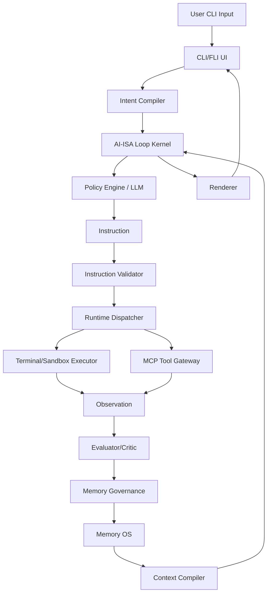
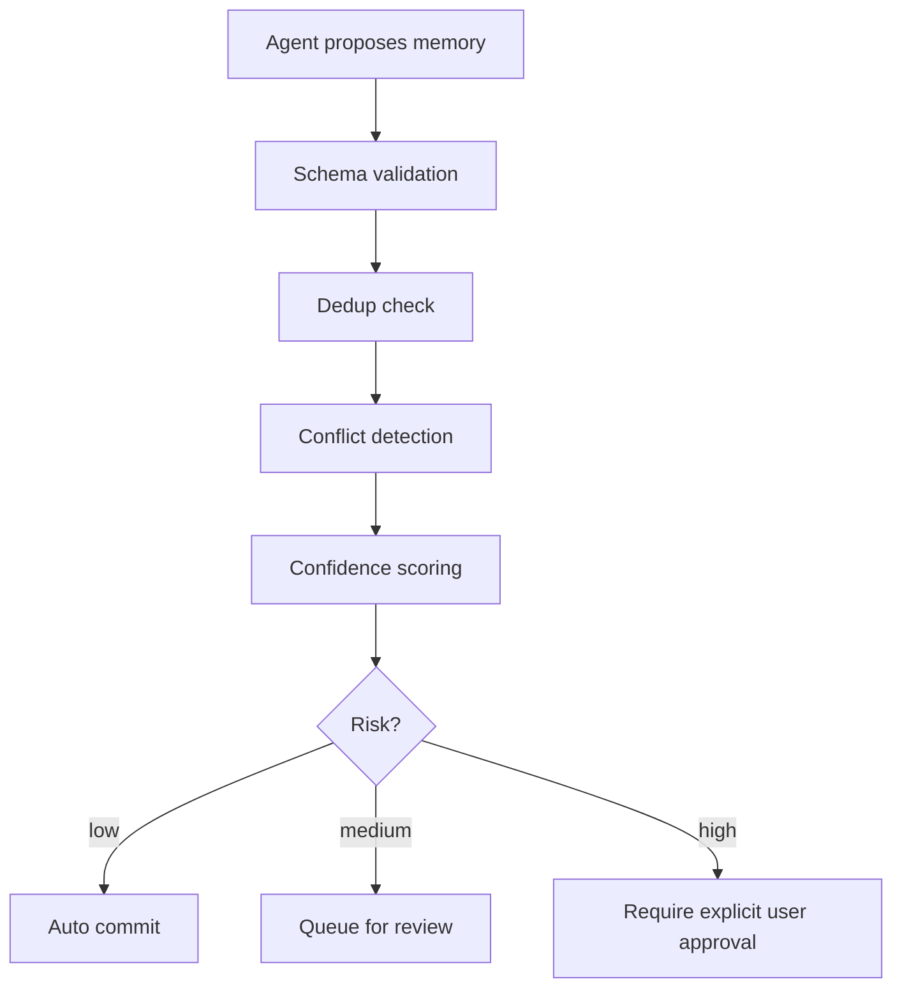
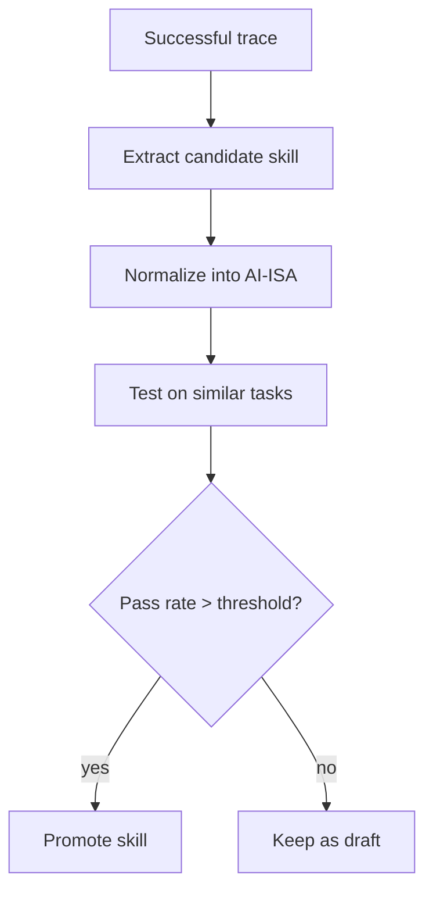

# LoopOS 完整开发指南与技术方案

> 版本：v0.1  
> 日期：2026-06-20  
> 目标：设计一个 **Terminal-native + MCP + State Machine + Self-improving Memory + CLI/FLI UI** 的下一代 AI Agent Runtime。  
> 定位：比传统 AutoGPT / Workflow Agent 更稳定，比纯 Claude Code/Codex 类工具更可扩展，比记忆型 Agent 更可执行。

---

## 0. 一句话总纲

LoopOS 不是“聊天机器人”，也不是单纯“代码助手”。它是一个：

> **以状态机为内核，以 MCP 为工具协议，以终端为执行锚点，以记忆治理为自我进化机制，以 CLI/FLI 为交互入口的 AI Agent Operating System。**

它的核心目标不是让模型“说得更像人”，而是让 AI 能够：

1. **理解目标**：把用户自然语言转成结构化任务。
2. **规划步骤**：生成可执行的 AI-ISA 指令序列。
3. **调用工具**：通过 MCP 调用文件、终端、浏览器、Git、数据库、API 等能力。
4. **执行任务**：优先通过终端 / 沙箱执行真实操作。
5. **观察反馈**：读取 stdout/stderr、文件变化、测试结果、API 响应等。
6. **自我评估**：根据验收条件判断是否前进、失败、停滞或完成。
7. **循环修复**：失败时自动重规划、修复、再执行。
8. **沉淀经验**：把成功/失败轨迹转成可复用 skill、belief、user model。
9. **减少语言化**：内部尽量使用结构化状态、DSL、指令集，不用自然语言堆上下文。
10. **对用户输出语言化**：最终产物按用户语言、审美、格式要求渲染。

---

## 1. 设计背景与核心判断

### 1.1 当前 Agent 工具的主要问题

现有 Agent 工具大致分四类：

| 类型 | 代表 | 优点 | 缺点 |
|---|---|---|---|
| Terminal Coding Agent | Claude Code、Codex CLI、OpenHands | 真实执行、代码环境强、能跑命令 | 个性化/记忆进化弱，很多能力围绕代码场景 |
| Workflow/Multi-Agent | CrewAI、AutoGen、LangGraph 应用、小龙虾类系统 | 多角色、任务编排、可视化流程 | 经常是“流程强、智能弱”，缺少真正收敛 loop |
| Memory Agent | Letta/MemGPT、Zep/Graphiti、Hermes 类 | 长期记忆、经验沉淀、上下文管理 | 执行力弱，记忆污染/错误学习风险高 |
| Tool-calling Chat | ChatGPT Tools、Gemini Tools、普通函数调用 | 工具生态广、使用简单 | 循环浅、状态弱、长期任务不稳定 |

LoopOS 的目标不是重复其中某一个，而是融合：

- Claude Code / Codex 的 **terminal + code execution + repo aware loop**。
- OpenHands 的 **sandboxed execution + software agent platform**。
- MCP 的 **统一工具协议**。
- LangGraph 的 **stateful graph / checkpoint / long-running agent 思路**。
- Letta/MemGPT、Zep 的 **长期记忆与状态代理思路**。
- Hermes 的 **skill / experience accumulation**。
- 小龙虾 / gateway 类系统的 **event-driven runtime / multi-channel gateway**。
- 自研核心：**AI-ISA + Memory Governance + Context Compiler + compressed internal protocol**。

### 1.2 最关键的产品判断

LoopOS 最重要的突破点不是“更多 Agent”，而是：

> **把 Agent 从自然语言自嗨循环，改造成可验证的状态机循环。**

传统 Prompt Loop：

```text
User Goal → LLM thinks in language → LLM writes command → execute → LLM explains → repeat
```

LoopOS Loop：

```text
User Goal → Intent Compiler → AI-ISA Instruction → State Transition → Tool Execution → Observation → Evaluation → Memory Governance → Next State
```

---

## 2. 产品定位

### 2.1 产品名称建议

可选命名：

- **LoopOS**：最直观，强调闭环操作系统。
- **AIVM**：AI Virtual Machine，强调指令集和状态机。
- **Clara**：Closed-loop Autonomous Reasoning Agent。
- **FLI Agent**：Fast Loop Interface / Functional Loop Interface，强调命令行流式执行。

建议开源项目名：

```text
loopos
```

CLI 命令：

```bash
loopos run "帮我检查这个 repo 的测试失败原因并修复"
loopos plan "把当前项目接入 MCP tool registry"
loopos inspect runs/2026-06-20-001
loopos skills list
loopos memory search "用户偏好"
```

### 2.2 MVP 目标

MVP 不做 WebUI，不做复杂可视化，不做多租户云平台。

MVP 只做：

1. CLI 输入目标。
2. LLM 生成结构化下一步指令。
3. 本地终端执行。
4. 捕获结果。
5. Critic 判断是否完成。
6. 循环最多 N 步。
7. 记录 JSONL 运行轨迹。
8. 可重放 run。
9. 可提取简单 skill。

### 2.3 成品目标

成品阶段需要具备：

- MCP tool hub。
- Rust sandbox executor。
- Python state machine kernel。
- TypeScript MCP gateway / event bus。
- Memory OS：working / episodic / semantic / skill / user model。
- AI-ISA 指令集。
- Context Compiler。
- 多 Agent 执行策略。
- 权限系统。
- 评测系统。
- 插件机制。
- CLI/FLI UI + 可选 TUI。

---

## 3. 可借鉴方向：哪些项目学什么

> 原则：借鉴公开文档、开源代码和可复现架构思想；不要依赖泄漏源码，不复制闭源实现。

### 3.1 Claude Code

可借鉴点：

- Terminal-first coding agent。
- 读取 codebase、编辑文件、运行命令、集成开发工具。
- 权限确认、危险命令审核、人类控制权。
- 长上下文压缩、项目规则文件、session storage。
- CLI 体验：流式输出、任务状态、命令确认。

不要照抄：

- 闭源内部实现。
- 未授权泄漏代码。
- 模型私有 prompt 或安全分类逻辑。

LoopOS 对应设计：

- `ExecutionKernel`。
- `PermissionManager`。
- `ProjectManifest`。
- `ContextCompactor`。
- `CLI Run Timeline`。

### 3.2 OpenAI Codex CLI

可借鉴点：

- 本地运行 coding agent。
- Git/workspace/diff-oriented loop。
- Patch、test、repair 循环。
- Rust native runtime 趋势。

LoopOS 对应设计：

- `PatchApplier`。
- `TestRunner`。
- `GitWorktreeIsolation`。
- `RustSandboxExecutor`。

### 3.3 MCP

可借鉴点：

- 用统一协议连接 AI 应用与外部系统。
- 工具、资源、提示模板标准化。
- MCP Host / Client / Server 分层。
- MCP 工具注册表。

LoopOS 对应设计：

- `MCPGateway`。
- `ToolRegistry`。
- `CapabilityDescriptor`。
- `ToolTrustPolicy`。

### 3.4 LangGraph

可借鉴点：

- Stateful graph。
- Long-running agent。
- Checkpoint / resume。
- Human-in-the-loop。
- Memory and persistence。

LoopOS 对应设计：

- 初期可以直接用 LangGraph 做 state graph。
- 后期将核心抽象迁移为自研 AI-ISA VM。

### 3.5 AutoGen / Microsoft Agent Framework

可借鉴点：

- 多 Agent 协作。
- Agent-to-agent message。
- Event-driven / typed orchestration。
- 企业级 telemetry / filters / session state。

LoopOS 对应设计：

- `AgentRole`。
- `MessageBus`。
- `TypedAgentEvent`。
- `SupervisorPolicy`。

### 3.6 CrewAI

可借鉴点：

- Crew / Flow 分层。
- 角色驱动任务。
- Guardrails、memory、observability。
- 简洁的开发者体验。

LoopOS 对应设计：

- `TaskCrew` 作为 Phase 3 可选层。
- `FlowRecipe` 保存可复用工作流。

### 3.7 Letta / MemGPT

可借鉴点：

- Agent memory OS 思想。
- 短期/长期记忆分离。
- 自编辑 memory。
- Agent state 由 memory、tools、messages 组成。

LoopOS 对应设计：

- `MemoryOS`。
- `MemoryWriter`。
- `WorkingMemory` / `LongTermMemory`。
- 但必须额外加 `MemoryGovernance`，防止错误学习。

### 3.8 Zep / Graphiti

可借鉴点：

- Temporal knowledge graph。
- 事实随时间变化。
- 将会话与结构化业务数据融合。

LoopOS 对应设计：

- Phase 2 用 SQLite + JSONL。
- Phase 3 引入 temporal graph memory。
- 每条 belief 有 `valid_from`、`valid_to`、`observed_at`、`confidence`。

### 3.9 OpenHands / OpenDevin

可借鉴点：

- AI 软件开发平台。
- 终端、浏览器、代码编辑能力。
- 沙箱执行。
- 多模型和 benchmark。

LoopOS 对应设计：

- `SandboxWorkspace`。
- `BrowserTool`。
- `BenchmarkHarness`。
- `AgentSDK`。

### 3.10 小龙虾 / OpenClaw / Gateway 类系统

可借鉴点：

- Multi-channel gateway。
- Event-driven runtime。
- Always-on automation。
- 外部入口：CLI、Webhook、IM、GitHub Issue、定时器。

LoopOS 对应设计：

- CLI-first。
- Phase 3 再加入 `EventGateway`。
- 不一开始做多入口，否则 MVP 会失控。

---

## 4. 技术栈与语言选择

### 4.1 总体原则

不要强行单语言。LoopOS 是分层系统：

| 层 | 首选语言 | 原因 |
|---|---|---|
| AI Brain / Loop Kernel | Python | LLM SDK、LangGraph、RAG、快速迭代最强 |
| MCP Gateway / Event Bus | TypeScript | Node 生态、MCP SDK、I/O、WebSocket、服务层强 |
| Secure Execution Runtime | Rust | 安全、性能、进程隔离、低层控制 |
| Shell Operation | Bash/sh | 真实世界操作接口 |
| Storage | SQLite/Postgres/JSONL | MVP 到生产平滑过渡 |

一句话：

```text
Python = Intelligence Plane
TypeScript = Control Plane
Rust = Execution Plane
Bash = Real-world Muscle
```

### 4.2 Phase 1 技术栈

只用 Python 即可：

- Python 3.11+
- Typer / Click：CLI
- Rich：终端 UI
- Pydantic v2：状态 schema
- OpenAI / Anthropic SDK：LLM
- subprocess：终端执行
- JSONL：运行日志
- SQLite：可选
- pytest：测试

目录：

```text
loopos/
  loopos/
    cli.py
    kernel/
    llm/
    execution/
    memory/
    ui/
  tests/
  pyproject.toml
```

### 4.3 Phase 2 技术栈

增加：

- TypeScript + Node 20+
- MCP TypeScript SDK
- Fastify / Hono：本地 HTTP gateway
- SQLite + sqlite-vec 或 Chroma：本地向量检索
- Docker：执行隔离
- GitPython / dulwich：git 状态读取

### 4.4 Phase 3 技术栈

增加：

- Rust + Tokio
- Postgres + pgvector
- Redis Streams / NATS：event bus
- OpenTelemetry：trace
- Temporal / Prefect：可选任务编排
- WASI / Firecracker / gVisor：更强隔离可选

### 4.5 为什么不一开始用 Rust 全写

Rust 适合 executor，不适合早期快速试 Agent 逻辑。AI Agent 的核心困难是策略、状态、评估、memory，而不是性能。早期应优先迭代速度。等 loop kernel 成熟后，再把稳定模块下沉到 Rust。

### 4.6 为什么不一开始用 TypeScript 全写

TS 适合 MCP 和服务，但 LLM/RAG/实验生态仍然 Python 更快。除非目标是做 VS Code 插件或浏览器优先，否则 Python core 更稳。

---

## 5. 总体架构

### 5.1 分层架构



### 5.2 核心模块

| 模块 | 职责 | MVP | 成品 |
|---|---|---|---|
| CLI/FLI UI | 用户输入、状态展示、确认 | Rich CLI | TUI/日志/回放 |
| Intent Compiler | 自然语言转结构化目标 | LLM JSON | Grammar constrained decode |
| AI-ISA Kernel | 执行指令循环 | Python while loop | State machine VM |
| Policy Engine | 根据 state 选择下一条指令 | LLM | LLM + rules + learned policy |
| Instruction Validator | 校验指令合法性 | JSON schema | Permission + capability + static analysis |
| Runtime Dispatcher | 分发给 MCP/terminal/memory | 简单 if/else | typed router |
| MCP Gateway | 工具协议 | Phase 2 | TS service |
| Terminal Executor | 执行 shell | subprocess | Rust sandbox |
| Evaluator/Critic | 判断进展 | LLM JSON | hybrid eval + tests |
| Memory OS | 记忆 | JSONL | temporal graph + vector |
| Memory Governance | 写入审查 | 简单规则 | belief merge / decay / audit |
| Context Compiler | 生成低 token 状态 | 模板 | retrieval + compression |
| Renderer | 用户输出 | Markdown | 用户风格化输出 |

---

## 6. AI-ISA 指令集设计

### 6.1 设计目标

AI-ISA 是 LoopOS 内部的“机器指令集”。它的目标是减少内部自然语言，让 Agent 内部交流从“聊天”变成“执行状态转移”。

原则：

1. 指令必须可 JSON Schema 校验。
2. 指令必须有确定副作用边界。
3. 所有工具调用必须经过 capability check。
4. 指令执行后必须产生 observation。
5. 指令不得携带长自然语言推理。
6. 指令可以携带短标签、枚举、结构化参数。

### 6.2 指令分类

#### A. Control 指令

```json
{"op":"TERMINATE","reason":"goal_complete","summary_ref":"obs_124"}
```

```json
{"op":"BRANCH","condition":"last_exit_code == 0","then":"eval_tests","else":"repair_error"}
```

```json
{"op":"LOOP_GUARD","max_steps":20,"max_cost_usd":2.0,"timeout_sec":1800}
```

#### B. Planning 指令

```json
{
  "op":"PLAN",
  "goal_id":"goal_001",
  "constraints":["no_network_without_approval","do_not_delete_files"],
  "acceptance":["tests_pass","summary_generated"]
}
```

```json
{
  "op":"SPLIT_TASK",
  "task_id":"task_001",
  "strategy":"dependency_first",
  "max_children":5
}
```

#### C. Tool 指令

```json
{
  "op":"CALL_TOOL",
  "tool":"terminal.exec",
  "args":{"cmd":"pytest -q","cwd":".","timeout_sec":120},
  "risk":"medium"
}
```

```json
{
  "op":"CALL_TOOL",
  "tool":"git.diff",
  "args":{"path":"."},
  "risk":"low"
}
```

#### D. State 指令

```json
{
  "op":"UPDATE_STATE",
  "path":"/progress/tests",
  "value":{"status":"failed","failures":3}
}
```

```json
{
  "op":"MERGE_STATE",
  "sources":["obs_10","obs_11"],
  "target":"/diagnosis"
}
```

#### E. Memory 指令

```json
{
  "op":"STORE_MEMORY",
  "memory_type":"episodic",
  "content_ref":"trace_001",
  "confidence":0.8,
  "governance":"requires_review"
}
```

```json
{
  "op":"UPDATE_BELIEF",
  "belief":"user_prefers_structured_markdown",
  "delta":0.12,
  "evidence_ref":"interaction_20260620_01"
}
```

```json
{
  "op":"EXTRACT_SKILL",
  "from_trace":"run_001",
  "trigger":"pytest_import_error",
  "min_success_evidence":1
}
```

#### F. Evaluation 指令

```json
{
  "op":"EVALUATE",
  "target":"goal_001",
  "criteria":["tests_pass","no_uncommitted_unwanted_changes"],
  "mode":"hybrid"
}
```

### 6.3 统一指令 Schema

```json
{
  "instruction_id":"ins_0001",
  "op":"CALL_TOOL",
  "args":{},
  "preconditions":[],
  "postconditions":[],
  "risk":"low|medium|high|critical",
  "requires_approval":false,
  "created_by":"policy_engine",
  "created_at":"2026-06-20T00:00:00Z"
}
```

### 6.4 指令执行结果 Observation Schema

```json
{
  "observation_id":"obs_0001",
  "instruction_id":"ins_0001",
  "status":"success|failure|timeout|denied",
  "stdout_ref":"blob_001",
  "stderr_ref":"blob_002",
  "exit_code":0,
  "artifacts":["file://report.md"],
  "metrics":{"duration_ms":1200,"tokens_in":800,"tokens_out":120},
  "created_at":"2026-06-20T00:00:01Z"
}
```

---

## 7. State 设计

### 7.1 为什么 State 是核心

LoopOS 的核心不是 prompt，而是 state。LLM 只根据当前 state 生成下一条指令，而不是把全部历史对话塞进去。

### 7.2 Global Run State

```json
{
  "run_id":"run_20260620_001",
  "goal":{
    "raw":"帮我修复测试失败",
    "structured":{
      "intent":"fix_tests",
      "target":"current_repo",
      "acceptance":["pytest passes","explain changes"]
    }
  },
  "phase":"executing",
  "step":4,
  "progress":0.45,
  "budget":{
    "max_steps":20,
    "max_tokens":100000,
    "max_cost_usd":3,
    "deadline_sec":1800
  },
  "workspace":{
    "cwd":"/project",
    "git_branch":"loopos/run_20260620_001",
    "dirty_files":[]
  },
  "current_plan":[],
  "observations":[],
  "errors":[],
  "memory_refs":[],
  "risk_level":"medium"
}
```

### 7.3 State Register 概念

像 CPU register 一样，LoopOS 可以维护一些固定寄存器：

| Register | 含义 |
|---|---|
| `G` | Goal register，当前目标 |
| `P` | Plan register，当前计划 |
| `S` | Status register，当前状态 |
| `O` | Observation register，最新观察 |
| `E` | Error register，错误摘要 |
| `M` | Memory register，相关记忆 refs |
| `B` | Budget register，预算和限制 |
| `R` | Risk register，风险等级 |

内部 policy prompt 只需要这些寄存器的压缩视图，而不是完整对话。

---

## 8. Loop Kernel 设计

### 8.1 MVP Loop

```python
while not state.done:
    compact_state = context_compiler.compile(state)
    instruction = policy.next_instruction(compact_state)
    validated = validator.validate(instruction, state)
    observation = dispatcher.execute(validated)
    evaluation = evaluator.evaluate(state, instruction, observation)
    state = reducer.reduce(state, instruction, observation, evaluation)
    memory_governor.consider_write(state, instruction, observation, evaluation)
    if stop_controller.should_stop(state):
        break
```

### 8.2 Reducer 模式

所有状态更新必须通过 reducer：

```python
def reduce(state, instruction, observation, evaluation):
    new_state = copy(state)
    new_state.step += 1
    new_state.observations.append(observation.id)
    new_state.progress = evaluation.progress
    if evaluation.error:
        new_state.errors.append(evaluation.error_summary)
    return new_state
```

这样可以保证：

- 状态变更可追踪。
- 可重放。
- 可调试。
- 可恢复。

### 8.3 Stop Controller

必须强制：

| 条件 | 动作 |
|---|---|
| 达成 acceptance | stop success |
| step 超限 | stop partial |
| cost 超限 | stop budget_exceeded |
| 连续 N 次无进展 | force replan / stop |
| 高风险命令未批准 | pause |
| sandbox violation | abort |

### 8.4 Stagnation Detection

```python
if last_3_progress_scores == [0.42, 0.42, 0.42]:
    emit("stagnation_detected")
    instruction = {"op":"PLAN", "strategy":"replan_from_failures"}
```

### 8.5 Progress Score

Progress 不是 LLM 随便说。它应由 hybrid evaluator 计算：

```text
progress = 0.4 * acceptance_completion
         + 0.2 * test_signal
         + 0.2 * artifact_signal
         + 0.1 * error_reduction
         + 0.1 * critic_confidence
```

---

## 9. Policy Engine 设计

### 9.1 LLM 的角色

LLM 不再是“自由聊天者”，而是：

1. Intent compiler。
2. Instruction proposer。
3. Critic / evaluator。
4. Renderer。

不要让同一个 LLM 同时执行所有角色，至少在逻辑上分离。

### 9.2 Policy 输入

Policy 不接收完整历史，只接收：

```json
{
  "goal":"...",
  "state_summary":"...",
  "available_ops":["CALL_TOOL","UPDATE_STATE","EVALUATE","TERMINATE"],
  "available_tools":["terminal.exec","git.diff","file.read"],
  "last_observation_summary":"...",
  "constraints":["no destructive command without approval"]
}
```

### 9.3 Policy 输出

必须是严格 JSON：

```json
{
  "op":"CALL_TOOL",
  "tool":"terminal.exec",
  "args":{"cmd":"pytest -q","timeout_sec":120},
  "risk":"medium",
  "expected_observation":"test result summary"
}
```

### 9.4 强制 JSON / Grammar Decode

MVP 可以用 prompt + JSON parse + retry。

成品建议：

- JSON Schema constrained decoding。
- Pydantic validation。
- Invalid instruction 自动修复，但最多 retry 2 次。

---

## 10. MCP Tool Layer 设计

### 10.1 Tool Registry

```json
{
  "tool_id":"terminal.exec",
  "name":"Terminal Execute",
  "description":"Execute shell command in sandboxed workspace",
  "input_schema":{},
  "output_schema":{},
  "risk":"variable",
  "capabilities":["read_fs","write_fs","run_process"],
  "requires_approval_for":["network","delete","sudo","secret_access"],
  "trust_level":"local_builtin"
}
```

### 10.2 内置工具清单

MVP：

- `terminal.exec`
- `file.read`
- `file.write`
- `file.search`
- `git.status`
- `git.diff`
- `git.apply_patch`

Phase 2：

- `browser.search`
- `browser.fetch`
- `http.request`
- `db.query`
- `package.inspect`
- `test.run`

Phase 3：

- `github.issue.read`
- `github.pr.create`
- `slack.post`
- `notion.page.update`
- `scheduler.create`
- 用户自定义 MCP server。

### 10.3 Tool Router

Tool Router 负责把 AI-ISA 指令映射到实际工具：

```python
if instruction.op == "CALL_TOOL":
    tool = registry.get(instruction.tool)
    permission.check(tool, instruction.args)
    return tool.invoke(instruction.args)
```

### 10.4 MCP 安全策略

必须内置：

1. 工具 descriptor 签名或 hash 固定。
2. 新 MCP server 首次使用必须用户批准。
3. 高风险 capability 明示。
4. 参数可见，不允许 hidden args。
5. 工具输出进入 LLM 前做 sanitization。
6. prompt injection 标记。
7. Tool call audit log。
8. Fail closed：工具不可用时默认失败而不是绕过权限。

---

## 11. Terminal / Sandbox Executor 设计

### 11.1 为什么 Terminal 是核心

Terminal 是最通用的执行接口：

- 可以运行测试。
- 可以操作 Git。
- 可以执行脚本。
- 可以调用包管理器。
- 可以读写文件。
- 可以运行本地工具。

Terminal 让 Agent 从“语言生成器”变成“现实执行器”。

### 11.2 MVP Executor

```python
import subprocess

def run_shell(cmd, cwd=".", timeout=120):
    result = subprocess.run(
        cmd,
        shell=True,
        cwd=cwd,
        capture_output=True,
        text=True,
        timeout=timeout,
    )
    return {
        "stdout": result.stdout[-20000:],
        "stderr": result.stderr[-20000:],
        "exit_code": result.returncode,
    }
```

### 11.3 成品 Rust Executor

Rust 负责：

- process spawning。
- timeout。
- resource limit。
- stdout/stderr streaming。
- working directory restriction。
- network policy。
- syscall / container integration。

Rust executor API：

```json
POST /execute
{
  "cmd":"pytest -q",
  "cwd":"/workspace/run_001",
  "timeout_sec":120,
  "env":{},
  "network":"deny|allow|ask",
  "fs_policy":"workspace_only"
}
```

返回：

```json
{
  "exit_code":0,
  "stdout_ref":"blob_001",
  "stderr_ref":"blob_002",
  "duration_ms":1832,
  "files_changed":["src/a.py"]
}
```

### 11.4 Git Worktree Isolation

每次 run 建立独立 worktree：

```bash
git worktree add .loopos/worktrees/run_001 -b loopos/run_001
```

好处：

- Agent 改动隔离。
- 可 diff。
- 可回滚。
- 多 Agent 不互相覆盖。

---

## 12. Memory OS 设计

### 12.1 五层记忆

| 层 | 名称 | 用途 | MVP 存储 | 成品存储 |
|---|---|---|---|---|
| L1 | Working Memory | 当前 run 状态 | JSON | SQLite |
| L2 | Episodic Memory | 执行轨迹 | JSONL | Postgres/Blob |
| L3 | Semantic / Belief Memory | 事实/偏好/项目知识 | JSON/SQLite | temporal graph + vector |
| L4 | Skill Memory | 成功模式/操作步骤 | JSON | skill DB + embeddings |
| L5 | User Model | 用户审美、格式、偏好 | JSON | profile graph |

### 12.2 Working Memory

只保存当前任务必要状态，不长期污染：

```json
{
  "current_task":"run tests",
  "last_error":"ModuleNotFoundError: x",
  "hypotheses":[
    {"id":"h1","text":"missing dependency","confidence":0.7}
  ]
}
```

### 12.3 Episodic Memory

JSONL：

```jsonl
{"t":"2026-06-20T00:00:00Z","event":"instruction","data":{...}}
{"t":"2026-06-20T00:00:02Z","event":"observation","data":{...}}
{"t":"2026-06-20T00:00:05Z","event":"evaluation","data":{...}}
```

用途：

- Debug。
- Replay。
- Skill extraction。
- Benchmark。

### 12.4 Belief Memory

不要把 memory 当 truth，要当 belief：

```json
{
  "belief_id":"belief_user_style_001",
  "subject":"user.output_style",
  "predicate":"prefers",
  "object":"detailed_markdown",
  "confidence":0.86,
  "context":["technical_planning","architecture_design"],
  "evidence_refs":["interaction_001","interaction_002"],
  "conflicts":[],
  "status":"active",
  "created_at":"2026-06-20T00:00:00Z",
  "updated_at":"2026-06-20T00:00:00Z"
}
```

### 12.5 Skill Memory

Skill 是“可复用过程”，不是单条事实。

```json
{
  "skill_id":"skill_pytest_import_error_fix",
  "name":"Fix Python import error in pytest",
  "trigger":{
    "error_pattern":"ModuleNotFoundError",
    "context":"pytest"
  },
  "steps":[
    {"op":"CALL_TOOL","tool":"terminal.exec","args":{"cmd":"python -c 'import sys; print(sys.path)'"}},
    {"op":"CALL_TOOL","tool":"terminal.exec","args":{"cmd":"find . -maxdepth 3 -name pyproject.toml -o -name setup.py"}},
    {"op":"CALL_TOOL","tool":"terminal.exec","args":{"cmd":"pytest -q"}}
  ],
  "success_rate":0.78,
  "attempts":9,
  "last_used":"2026-06-20T00:00:00Z"
}
```

### 12.6 User Model

用户模型用于最终输出，而不是污染内部推理。

```json
{
  "language":"zh-CN",
  "detail_level":"very_detailed",
  "format":"markdown",
  "style":{
    "likes_tables":true,
    "likes_architecture_diagrams":true,
    "prefers_direct_strategy":true
  },
  "aesthetic":{
    "tone":"professional",
    "structure":"clear_hierarchical",
    "emoji":"low_to_medium"
  }
}
```

---

## 13. Memory Governance 设计

### 13.1 为什么需要治理

没有治理的 memory 会导致：

- 错误学习。
- 上下文污染。
- 偏见固化。
- 旧信息压制新信息。
- 多 Agent 互相污染。

### 13.2 写入流程



### 13.3 Memory Proposal Schema

```json
{
  "proposal_id":"mp_001",
  "memory_type":"belief|skill|episodic|user_model",
  "content":{},
  "evidence_refs":["obs_001"],
  "confidence":0.71,
  "scope":"global|project|user|agent_local",
  "ttl_days":180,
  "risk":"low"
}
```

### 13.4 冲突处理

错误做法：

```text
覆盖旧记忆。
```

正确做法：

```json
{
  "subject":"user.detail_preference",
  "beliefs":[
    {"value":"concise","confidence":0.62,"context":["quick_questions"]},
    {"value":"very_detailed","confidence":0.91,"context":["architecture_planning"]}
  ]
}
```

### 13.5 Decay 机制

```python
confidence = confidence * exp(-lambda * days_since_last_evidence)
```

但 skill 的 decay 不只看时间，还看失败率。

### 13.6 Global Memory 与 Local Memory

每个 Agent 有 local memory：

- 可写。
- 可丢弃。
- 用于角色特化。

Global memory：

- append-only。
- versioned。
- governance approved。
- 不允许单 Agent 直接覆盖。

---

## 14. Context Compiler：彻底降低 token 的关键

### 14.1 设计目标

不要把所有 history 塞给 LLM。Context Compiler 只输出当前决策所需的最小结构化状态。

### 14.2 输入

- Global state。
- Last observation。
- Relevant memory refs。
- Tool registry summary。
- Budget / risk constraints。
- User model only when rendering needed。

### 14.3 输出：Policy Context

```json
{
  "goal":"fix failing tests",
  "progress":0.45,
  "last_error":"3 pytest failures, likely import path issue",
  "available_tools":["terminal.exec","file.read","git.diff"],
  "constraints":["ask before deleting files"],
  "candidate_skills":["skill_pytest_import_error_fix"],
  "next_decision_required":"choose diagnostic command"
}
```

### 14.4 Token 优化策略

1. Observation 原文存 blob，只给摘要。
2. stdout/stderr 按错误栈、关键词、尾部片段压缩。
3. Tool registry 只给当前相关工具。
4. Memory 只给 belief id + 短摘要 + confidence。
5. Agent 内部不用解释性自然语言。
6. 最终输出时才调用 renderer 生成中文/英文/报告格式。

---

## 15. 内部去语言化与 Agent 通信协议

### 15.1 原则

Agent 间不互相发长文本，而发结构化消息。

### 15.2 Agent Message Schema

```json
{
  "from":"critic",
  "to":"planner",
  "type":"evaluation",
  "payload":{
    "status":"failed",
    "reason_code":"test_failure",
    "confidence":0.82,
    "evidence_refs":["obs_012"],
    "recommended_ops":["CALL_TOOL:file.read","CALL_TOOL:terminal.exec"]
  }
}
```

### 15.3 Reason Codes

用枚举替代长解释：

```text
NO_PROGRESS
TEST_FAILURE
SYNTAX_ERROR
MISSING_DEPENDENCY
PERMISSION_REQUIRED
GOAL_COMPLETE
NEED_USER_DECISION
TOOL_UNAVAILABLE
CONFLICTING_MEMORY
```

### 15.4 内部压缩收益

| 通信方式 | Token | 稳定性 | 可验证性 |
|---|---:|---:|---:|
| 自然语言 | 高 | 中 | 低 |
| JSON/DSL | 低 | 高 | 高 |
| 状态寄存器 | 极低 | 极高 | 极高 |

---

## 16. Self-improvement：自我升级增强设计

### 16.1 自我升级不是让 Agent 改自己核心代码

危险做法：

```text
Agent 自动修改自己的 loop kernel 并立即运行。
```

正确做法：

1. Agent 提出改进 proposal。
2. 生成 patch。
3. 在 sandbox 中跑测试。
4. Benchmark 对比旧版本。
5. 人类审批或自动 gate。
6. 合并到 skill/policy，而不是直接改 kernel。

### 16.2 Skill Extraction

从成功 run 中抽取：

- Trigger。
- Preconditions。
- Instruction sequence。
- Expected observations。
- Failure fallback。
- Success criteria。

### 16.3 Skill Promotion Pipeline



### 16.4 Policy Improvement

短期：

- 更新 prompt templates。
- 更新 tool routing preference。
- 更新 skill success_rate。

中期：

- 用 trace 数据训练 reward model / classifier。
- 训练 instruction selector。

长期：

- 小模型本地 policy network。
- LLM 只做 fallback。

### 16.5 评测驱动自我升级

所有自我升级必须通过 eval：

- SWE-bench style coding tasks。
- 自定义 terminal tasks。
- Memory retrieval tasks。
- MCP security tasks。
- User style rendering tasks。

---

## 17. Evaluator / Critic 设计

### 17.1 不要只靠 LLM 判断完成

完成条件必须混合：

- 文件是否存在。
- 测试是否通过。
- exit code 是否为 0。
- diff 是否符合预期。
- API response 是否满足 schema。
- LLM critic 是否认可。

### 17.2 Evaluation Schema

```json
{
  "done":false,
  "success":false,
  "progress":0.58,
  "error":{
    "code":"TEST_FAILURE",
    "summary":"2 tests still failing"
  },
  "next_hint":"inspect failing test file",
  "confidence":0.76
}
```

### 17.3 Critic 角色分离

至少逻辑上分离：

- Planner：提议下一步。
- Executor：执行。
- Critic：判断。
- Governor：判断是否写 memory。
- Renderer：对用户输出。

MVP 可以同一个模型不同 prompt；成品可以多模型。

---

## 18. Permission / Safety 设计

### 18.1 风险等级

| 风险 | 示例 | 策略 |
|---|---|---|
| Low | `ls`, `cat`, `git status` | 自动执行 |
| Medium | `pytest`, `npm test`, 写工作区文件 | 自动或可配置 |
| High | 删除文件、安装包、访问网络、提交 Git | 需要确认 |
| Critical | `sudo`, 读取 secrets, rm -rf, 上传数据 | 默认禁止 |

### 18.2 命令分类器

MVP 用规则：

```python
critical_patterns = ["sudo", "rm -rf /", "chmod -R 777", "cat ~/.ssh", "env | grep"]
```

成品：

- 规则 + LLM classifier + allowlist。
- 命令 AST 解析。
- shellcheck-like static analysis。

### 18.3 Secret 防泄漏

- stdout/stderr 进入模型前做 secret scan。
- `.env` 默认不可读。
- SSH key、token、cookie 路径默认禁止。
- 网络请求携带敏感内容时必须审批。

---

## 19. CLI / FLI UI 设计

> 你提到 FLI UI，这里按 **Fast Loop Interface / Functional Loop Interface** 处理：不是 WebUI，而是为 Agent Loop 优化的命令行交互体验。

### 19.1 CLI 设计原则

1. 先快后全。
2. 所有行为可见。
3. 高风险动作必须确认。
4. 每一步有状态、有进度、有原因码。
5. 支持 resume / replay / inspect。
6. 支持非交互模式，用于 CI。

### 19.2 命令设计

```bash
loopos run "修复当前项目测试"
loopos run --max-steps 20 --approval-mode ask "重构 auth 模块"
loopos plan "实现 MCP tool registry"
loopos inspect run_001
loopos replay run_001
loopos diff run_001
loopos approve ins_012
loopos memory search "用户审美"
loopos skills list
loopos skills show skill_pytest_import_error_fix
loopos config set approval_mode ask
```

### 19.3 Run 页面布局

```text
LoopOS v0.1  run_20260620_001
Goal: 修复当前项目测试失败
Mode: sandbox | approval: ask-high | steps: 4/20 | cost: $0.12

[STATE]
progress: 0.45
phase: diagnosing
last_reason: TEST_FAILURE

[PLAN]
1. Run tests                         done
2. Inspect failure logs              done
3. Read failing module               running
4. Apply minimal patch               pending
5. Re-run tests                      pending

[NEXT ACTION]
CALL_TOOL terminal.exec
cmd: sed -n '1,200p' tests/test_auth.py
risk: low

[OBSERVATION]
...
```

### 19.4 审批交互

```text
High-risk action requested:
  tool: terminal.exec
  cmd: npm install axios
  reason: missing dependency detected
  risk: modifies package-lock and downloads network package

Approve? [y]es / [n]o / [e]dit / [a]lways allow npm install for this run:
```

### 19.5 最终报告

```markdown
## Result
Status: Completed
Steps: 8
Files changed: 2
Tests: passed

## What changed
- Fixed import path in `src/auth.py`
- Updated test fixture in `tests/test_auth.py`

## Verification
- `pytest -q` passed

## Learned Skill Candidate
- `skill_pytest_import_path_fix` queued for review
```

### 19.6 TUI 可选方向

后期可用：

- Python Textual。
- Bubble Tea / Go。
- Ink / React terminal。

但 MVP 用 Rich 足够。

---

## 20. Repo 结构设计

### 20.1 MVP Repo

```text
loopos/
├── pyproject.toml
├── README.md
├── loopos/
│   ├── __init__.py
│   ├── cli.py
│   ├── config.py
│   ├── kernel/
│   │   ├── loop.py
│   │   ├── state.py
│   │   ├── instruction.py
│   │   ├── reducer.py
│   │   └── stop.py
│   ├── llm/
│   │   ├── client.py
│   │   ├── policy.py
│   │   ├── evaluator.py
│   │   └── prompts.py
│   ├── execution/
│   │   ├── terminal.py
│   │   └── permissions.py
│   ├── memory/
│   │   ├── store.py
│   │   ├── episodic.py
│   │   ├── skills.py
│   │   └── user_model.py
│   ├── ui/
│   │   ├── console.py
│   │   └── render.py
│   └── utils/
│       ├── json.py
│       └── ids.py
├── tests/
│   ├── test_instruction_schema.py
│   ├── test_permissions.py
│   └── test_loop_smoke.py
└── examples/
    ├── fix_tests.md
    └── create_file.md
```

### 20.2 成品 Monorepo

```text
loopos/
├── apps/
│   ├── cli-python/
│   ├── gateway-ts/
│   └── sandbox-rs/
├── packages/
│   ├── ai-isa-schema/
│   ├── mcp-tools/
│   ├── memory-wire/
│   ├── eval-harness/
│   └── skill-library/
├── docs/
│   ├── architecture.md
│   ├── ai-isa.md
│   ├── mcp-security.md
│   ├── memory-governance.md
│   └── cli-ui.md
├── examples/
├── benchmarks/
└── docker/
```

---

## 21. 每一阶段开发计划

## Phase 0：规格冻结（1-3 天）

目标：不要写太多代码，先确定边界。

交付物：

- `docs/architecture.md`
- `docs/ai-isa.md`
- `docs/state-schema.md`
- `docs/security-model.md`
- `README.md`

验收标准：

- 能清楚说明 LoopOS 与普通 agent 的差异。
- AI-ISA 至少 10 条指令。
- State schema 能覆盖 goal、plan、obs、eval、memory refs。

---

## Phase 1：MVP CLI Loop Agent（1-2 周）

目标：能在 CLI 中循环执行简单任务。

功能：

- `loopos run "goal"`
- Policy 输出 JSON 指令。
- Terminal 执行。
- Evaluator 判断。
- JSONL 记录轨迹。
- Rich 展示进度。

核心文件：

- `cli.py`
- `kernel/loop.py`
- `kernel/instruction.py`
- `execution/terminal.py`
- `llm/policy.py`
- `llm/evaluator.py`
- `memory/store.py`

验收场景：

1. 创建一个文件并写入内容。
2. 运行 `pytest` 并总结结果。
3. 找出一个简单 Python 报错并修复。
4. 遇到 `rm -rf` 拒绝执行。
5. run 可 replay。

不要做：

- 不做 WebUI。
- 不做多 Agent。
- 不做复杂向量库。
- 不做云同步。

---

## Phase 2：MCP + Memory + Critic 强化（2-4 周）

目标：从能跑变成稳定可用。

功能：

- 本地 MCP gateway。
- Tool registry。
- Permission manager。
- Skill candidate extraction。
- SQLite memory。
- Context compiler。
- Better evaluator。
- `loopos inspect` / `loopos replay` / `loopos diff`。

验收标准：

- 能接入至少 3 个 MCP 工具。
- 能从一次成功 run 生成 skill draft。
- 能根据 skill draft 影响下一次计划。
- 连续无进展 3 次会 replan。
- 所有高风险工具调用进入审批。

---

## Phase 3：AI-ISA VM 化（4-8 周）

目标：内部彻底结构化，减少自然语言 token。

功能：

- AI-ISA instruction executor。
- State reducer。
- Structured agent messages。
- Internal DSL。
- JSON Schema constrained instruction。
- Reason code system。
- Observation blob store。

验收标准：

- Policy prompt token 比 Phase 1 降低 50%+。
- 大多数内部消息为 JSON/DSL。
- 完整 run 可以由 instruction log 重放。
- Renderer 与 Policy 分离。

---

## Phase 4：Rust Sandbox Runtime（6-10 周）

目标：提升安全性和执行能力。

功能：

- Rust process executor。
- timeout / cwd / env / fs policy。
- stdout/stderr streaming。
- Git worktree isolation。
- Docker backend。
- resource limit。

验收标准：

- Dangerous commands 被阻止。
- Workspace 外文件不可写。
- 每次 run 独立 worktree。
- Executor crash 不影响 kernel。

---

## Phase 5：Memory Governance + User Model（8-12 周）

目标：真正进入自我进化。

功能：

- Belief memory。
- Conflict resolver。
- Confidence update。
- Decay。
- User model。
- Skill promotion pipeline。
- Memory review CLI。

命令：

```bash
loopos memory pending
loopos memory approve mp_001
loopos memory reject mp_002
loopos user-model show
loopos skills promote skill_001
```

验收标准：

- 新记忆不会直接污染 global memory。
- 矛盾偏好被条件化存储。
- User output 能根据 user model 改变格式。
- Skill 需要通过 gate 才 promotion。

---

## Phase 6：Multi-Agent / Event Runtime（12-16 周）

目标：支持多角色和 always-on。

功能：

- Planner / Executor / Critic / Memory Governor 分离。
- Event bus。
- Scheduler。
- Webhook trigger。
- Background tasks。
- Multi-worktree isolation。

验收标准：

- 多 Agent 不共享 private context。
- 只通过 structured message 交流。
- Global memory 写入必须 governance。
- 可以定时执行任务。

---

## Phase 7：产品化 / 成品（16 周+）

功能：

- Plugin marketplace / tool packs。
- Team config。
- Telemetry dashboard。
- Eval suite。
- Local/Cloud hybrid。
- Enterprise security。
- 可选 WebUI。

---

## 22. 优化方向

### 22.1 Token 优化

- 内部 DSL。
- Context compiler。
- Observation compression。
- Memory refs instead of raw memory。
- Tool registry relevance filtering。
- Renderer 单独调用。

### 22.2 速度优化

- 并行工具调用。
- 小模型做 classifier。
- 大模型只做 planner/critic。
- 缓存 project summary。
- stdout 增量分析。

### 22.3 成本优化

- Policy state minimal。
- Skill-first planning：先查 skill，再问大模型。
- Eval 尽量 rule-based。
- 失败重试限制。
- 模型路由：cheap model for low-risk steps。

### 22.4 稳定性优化

- 强 schema。
- Instruction validation。
- Stop guards。
- Worktree rollback。
- Deterministic reducer。
- Replay tests。

### 22.5 安全优化

- Capability-based permission。
- Tool descriptor signing。
- Prompt injection detection。
- Secret redaction。
- Network egress control。
- Audit log。

### 22.6 智能优化

- Skill library。
- Failure clustering。
- Memory governance。
- Benchmark-driven policy tuning。
- Multi-agent critic。

---

## 23. Benchmark 与测试设计

### 23.1 单元测试

- instruction schema。
- reducer determinism。
- permission classifier。
- terminal executor timeout。
- memory merge。

### 23.2 集成测试

- create file task。
- run tests task。
- fix simple bug task。
- MCP tool call task。
- denied command task。

### 23.3 Agent Benchmark

自建任务集：

```text
benchmarks/
  file_ops/
  python_bugfix/
  node_bugfix/
  git_workflow/
  memory_recall/
  user_style_rendering/
  mcp_security/
```

### 23.4 关键指标

| 指标 | 含义 |
|---|---|
| task_success_rate | 任务成功率 |
| avg_steps | 平均步骤数 |
| avg_cost | 平均成本 |
| avg_latency | 平均耗时 |
| unsafe_call_block_rate | 危险调用拦截率 |
| memory_precision | 写入记忆准确率 |
| skill_reuse_rate | skill 复用率 |
| rollback_success | 回滚成功率 |

---

## 24. 配置文件设计

### 24.1 `loopos.yaml`

```yaml
model:
  planner: gpt-4.1
  critic: gpt-4.1-mini
  renderer: gpt-4.1-mini

runtime:
  executor: python_subprocess
  sandbox: false
  max_steps: 20
  timeout_sec: 1800

approval:
  mode: ask_high
  allow_low_risk: true
  deny_critical: true

memory:
  backend: sqlite
  enable_skills: true
  enable_user_model: true
  governance: strict

tools:
  enabled:
    - terminal.exec
    - file.read
    - file.write
    - git.status
    - git.diff
```

### 24.2 Project Manifest

类似 `CLAUDE.md` / agent manifest：

```markdown
# LOOPOS.md

## Project Commands
- Test: `pytest -q`
- Lint: `ruff check .`
- Typecheck: `mypy .`

## Architecture
- Source code in `src/`
- Tests in `tests/`

## Agent Rules
- Do not modify public API without approval.
- Prefer minimal patches.
- Always run tests after code changes.
```

---

## 25. MVP 代码骨架示例

### 25.1 Instruction Model

```python
from pydantic import BaseModel
from typing import Literal, Dict, Any

class Instruction(BaseModel):
    op: Literal["CALL_TOOL", "UPDATE_STATE", "EVALUATE", "TERMINATE", "PLAN"]
    tool: str | None = None
    args: Dict[str, Any] = {}
    risk: Literal["low", "medium", "high", "critical"] = "low"
    requires_approval: bool = False
```

### 25.2 State Model

```python
from pydantic import BaseModel, Field

class RunState(BaseModel):
    run_id: str
    goal: str
    step: int = 0
    progress: float = 0.0
    done: bool = False
    observations: list[dict] = Field(default_factory=list)
    errors: list[str] = Field(default_factory=list)
```

### 25.3 Loop Engine

```python
class LoopEngine:
    def __init__(self, policy, dispatcher, evaluator, memory, ui, stop):
        self.policy = policy
        self.dispatcher = dispatcher
        self.evaluator = evaluator
        self.memory = memory
        self.ui = ui
        self.stop = stop

    def run(self, state):
        while not self.stop.should_stop(state):
            ctx = self.memory.compile_context(state)
            instruction = self.policy.next(ctx)
            self.ui.show_instruction(instruction)
            observation = self.dispatcher.execute(instruction)
            evaluation = self.evaluator.evaluate(state, instruction, observation)
            state = self.memory.reduce(state, instruction, observation, evaluation)
            self.ui.show_state(state)
            if evaluation.done:
                state.done = True
                break
        return state
```

---

## 26. 风险清单

| 风险 | 说明 | 对策 |
|---|---|---|
| Loop 跑飞 | 无限尝试无进展 | max steps + stagnation detection |
| 工具误用 | 执行危险命令 | permission + sandbox |
| 记忆污染 | 错误写入长期记忆 | governance + confidence |
| Prompt injection | 工具输出污染模型 | sanitization + separation |
| 成本爆炸 | 多轮 LLM 调用 | DSL + context compiler |
| 用户模型误判 | 个性化越学越偏 | 用户可查看/编辑/删除 |
| 过度自动化 | 未经确认修改重要资源 | risk-based approval |
| 多 Agent 混乱 | 互相污染上下文 | local memory + structured protocol |

---

## 27. 开源策略

### 27.1 License

建议：

- 核心：Apache-2.0 或 MIT。
- 企业版插件另行闭源可选。

### 27.2 README 卖点

```text
LoopOS is a terminal-native, MCP-powered, state-machine AI agent runtime.
It runs real commands, learns reusable skills, and keeps agent reasoning structured instead of stuffing context windows.
```

### 27.3 首批 Demo

1. Fix failing pytest tests。
2. Generate project README。
3. Add MCP tool。
4. Inspect repo and produce architecture report。
5. Learn a skill from a successful run。

### 27.4 社区插件方向

- `loopos-tool-github`
- `loopos-tool-browser`
- `loopos-tool-postgres`
- `loopos-skill-python`
- `loopos-skill-frontend`
- `loopos-memory-zep`
- `loopos-runtime-docker`

---

## 28. 最终成品愿景

LoopOS 成品应该像这样运行：

```bash
loopos run "帮我把这个项目升级到 Python 3.13，修复测试，并生成迁移报告"
```

系统内部：

1. 编译目标为结构化 goal。
2. 建立 git worktree。
3. 检索相关 skill。
4. 生成 AI-ISA 指令。
5. 调用 terminal / MCP。
6. 运行测试。
7. 失败时诊断。
8. 应用 patch。
9. 再测试。
10. 生成报告。
11. 提取新 skill。
12. 更新 user model。

用户看到的是：

```text
✓ Created isolated worktree
✓ Found Python version constraints
✓ Updated pyproject.toml
✓ Fixed 2 compatibility issues
✓ Tests passed: 124/124
✓ Migration report written: reports/python313-migration.md
✓ Skill candidate created: python-version-upgrade
```

---

## 29. 推荐开发顺序（非常具体）

第一周：

1. 建 repo。
2. 写 `RunState`、`Instruction` schema。
3. 写 `terminal.exec`。
4. 写 LLM policy：输出 JSON instruction。
5. 写 evaluator：输出 done/progress/error。
6. 写 Rich CLI。
7. 跑通 create-file demo。

第二周：

1. 加 permission classifier。
2. 加 JSONL trace。
3. 加 replay。
4. 加 git diff。
5. 跑通 simple bugfix demo。
6. 写 README。

第三到四周：

1. SQLite memory。
2. Skill candidate extraction。
3. MCP gateway prototype。
4. Context compiler。
5. Inspect UI。

第五到八周：

1. AI-ISA 完整化。
2. Rust executor prototype。
3. Worktree isolation。
4. Memory governance。
5. Benchmark suite。

---

## 30. 最后总结

LoopOS 的核心不是“做一个更会说话的 Agent”，而是：

> **做一个能把目标转成状态机，把工具调用转成可审计指令，把执行结果转成可验证反馈，把经验转成可治理记忆的 AI Runtime。**

真正的差异化在五个地方：

1. **Terminal-native**：真实执行，而不是只聊天。
2. **MCP-first**：工具能力标准化。
3. **AI-ISA**：内部去语言化，降低 token 和污染。
4. **Memory Governance**：会学习，但不乱学。
5. **FLI/CLI-first**：先做开发者可用的 loop runtime，再做 WebUI。

如果按这个路线推进，MVP 两周内可以跑起来；两个月可以做到明显强于普通 workflow agent；三到四个月可以形成一个有开源影响力的 Agent Runtime 项目。

---

## 31. 参考资料与延伸阅读

> 以下为设计参考方向，建议只学习公开文档、官方开源仓库、论文和公开 SDK，不复制任何未授权来源。

- Claude Code 官方文档：`https://code.claude.com/docs/en/overview`
- OpenAI Codex CLI GitHub：`https://github.com/openai/codex`
- MCP 官方介绍：`https://modelcontextprotocol.io/docs/getting-started/intro`
- MCP TypeScript SDK：`https://github.com/modelcontextprotocol/typescript-sdk`
- MCP Security Best Practices：`https://modelcontextprotocol.io/docs/tutorials/security/security_best_practices`
- LangGraph 官方文档：`https://docs.langchain.com/oss/python/langgraph/overview`
- Microsoft Agent Framework：`https://learn.microsoft.com/en-us/agent-framework/overview/`
- AutoGen GitHub：`https://github.com/microsoft/autogen`
- CrewAI 文档：`https://docs.crewai.com/`
- Letta GitHub：`https://github.com/letta-ai/letta`
- Zep 官网：`https://www.getzep.com/`
- OpenHands GitHub：`https://github.com/OpenHands/openhands`
- OpenHands 论文：`https://arxiv.org/abs/2407.16741`

---

# 附录 A：工程 API 契约设计

## A.1 Python Core 对外接口

Python Core 是 LoopOS 的智能内核。它不直接暴露给外部用户，而由 CLI 调用。

### `LoopEngine.run()`

```python
class LoopEngine:
    def run(
        self,
        goal: str,
        workspace: str,
        config: LoopConfig,
    ) -> RunResult:
        ...
```

输入：

```json
{
  "goal":"修复当前项目测试失败",
  "workspace":"/Users/me/project",
  "config":{
    "max_steps":20,
    "approval_mode":"ask_high",
    "sandbox":true
  }
}
```

输出：

```json
{
  "run_id":"run_001",
  "status":"completed|failed|partial|aborted",
  "summary":"...",
  "artifacts":["report.md"],
  "steps":12,
  "cost":0.38
}
```

## A.2 Runtime Dispatcher 接口

```python
class RuntimeDispatcher:
    def execute(self, instruction: Instruction, state: RunState) -> Observation:
        ...
```

职责：

- 判断 instruction 类型。
- 调用 permission manager。
- 调 MCP 或 terminal executor。
- 将结果规范化为 observation。

## A.3 MCP Gateway API

Phase 2 可用 HTTP/stdio 双模式。

### List Tools

```http
GET /tools
```

返回：

```json
{
  "tools":[
    {
      "tool_id":"terminal.exec",
      "description":"Execute shell command",
      "risk":"variable",
      "input_schema":{}
    }
  ]
}
```

### Invoke Tool

```http
POST /tools/{tool_id}/invoke
```

请求：

```json
{
  "run_id":"run_001",
  "args":{"cmd":"pytest -q","cwd":"/workspace"},
  "context":{"risk":"medium"}
}
```

响应：

```json
{
  "status":"success",
  "observation":{
    "exit_code":0,
    "stdout_ref":"blob_001",
    "stderr_ref":"blob_002"
  }
}
```

## A.4 Rust Executor API

### Process Execute

```http
POST /v1/execute
```

请求：

```json
{
  "cmd":"pytest -q",
  "cwd":"/sandbox/run_001",
  "timeout_ms":120000,
  "env":{},
  "network":"deny",
  "write_policy":"workspace_only",
  "max_output_bytes":200000
}
```

响应：

```json
{
  "exit_code":1,
  "stdout":"...",
  "stderr":"...",
  "duration_ms":5321,
  "files_changed":["src/auth.py"],
  "resource_usage":{
    "max_rss_mb":210,
    "cpu_ms":1200
  }
}
```

---

# 附录 B：数据库与存储 Schema

## B.1 MVP 文件存储

```text
.loopos/
├── config.yaml
├── runs/
│   └── run_001/
│       ├── state.json
│       ├── trace.jsonl
│       ├── blobs/
│       │   ├── stdout_001.txt
│       │   └── stderr_001.txt
│       ├── report.md
│       └── diff.patch
├── memory/
│   ├── beliefs.jsonl
│   ├── skills.jsonl
│   └── user_model.json
└── cache/
```

## B.2 SQLite Schema

### `runs`

```sql
CREATE TABLE runs (
  run_id TEXT PRIMARY KEY,
  goal_raw TEXT NOT NULL,
  goal_structured JSON,
  status TEXT NOT NULL,
  progress REAL DEFAULT 0,
  started_at TEXT NOT NULL,
  ended_at TEXT,
  workspace TEXT,
  cost_usd REAL DEFAULT 0
);
```

### `instructions`

```sql
CREATE TABLE instructions (
  instruction_id TEXT PRIMARY KEY,
  run_id TEXT NOT NULL,
  step INTEGER NOT NULL,
  op TEXT NOT NULL,
  tool TEXT,
  args JSON,
  risk TEXT,
  requires_approval INTEGER DEFAULT 0,
  created_at TEXT NOT NULL,
  FOREIGN KEY(run_id) REFERENCES runs(run_id)
);
```

### `observations`

```sql
CREATE TABLE observations (
  observation_id TEXT PRIMARY KEY,
  instruction_id TEXT NOT NULL,
  run_id TEXT NOT NULL,
  status TEXT NOT NULL,
  exit_code INTEGER,
  stdout_ref TEXT,
  stderr_ref TEXT,
  metrics JSON,
  created_at TEXT NOT NULL,
  FOREIGN KEY(instruction_id) REFERENCES instructions(instruction_id)
);
```

### `evaluations`

```sql
CREATE TABLE evaluations (
  evaluation_id TEXT PRIMARY KEY,
  observation_id TEXT NOT NULL,
  run_id TEXT NOT NULL,
  done INTEGER DEFAULT 0,
  success INTEGER DEFAULT 0,
  progress REAL DEFAULT 0,
  reason_code TEXT,
  confidence REAL,
  next_hint TEXT,
  created_at TEXT NOT NULL
);
```

### `beliefs`

```sql
CREATE TABLE beliefs (
  belief_id TEXT PRIMARY KEY,
  subject TEXT NOT NULL,
  predicate TEXT NOT NULL,
  object TEXT NOT NULL,
  context JSON,
  confidence REAL NOT NULL,
  status TEXT DEFAULT 'active',
  version INTEGER DEFAULT 1,
  evidence_refs JSON,
  conflict_refs JSON,
  created_at TEXT NOT NULL,
  updated_at TEXT NOT NULL,
  expires_at TEXT
);
```

### `skills`

```sql
CREATE TABLE skills (
  skill_id TEXT PRIMARY KEY,
  name TEXT NOT NULL,
  trigger JSON NOT NULL,
  instruction_sequence JSON NOT NULL,
  success_rate REAL DEFAULT 0,
  attempts INTEGER DEFAULT 0,
  status TEXT DEFAULT 'draft',
  created_at TEXT NOT NULL,
  updated_at TEXT NOT NULL
);
```

### `memory_proposals`

```sql
CREATE TABLE memory_proposals (
  proposal_id TEXT PRIMARY KEY,
  memory_type TEXT NOT NULL,
  content JSON NOT NULL,
  confidence REAL,
  risk TEXT,
  status TEXT DEFAULT 'pending',
  evidence_refs JSON,
  created_at TEXT NOT NULL,
  reviewed_at TEXT
);
```

---

# 附录 C：核心 Prompt / Compiler 模板

> 目标不是依赖 prompt，而是在 MVP 阶段用 prompt 过渡。成品应逐步转向 schema constrained decoding。

## C.1 Intent Compiler Prompt

```text
You are an intent compiler for an AI state-machine agent.
Convert the user's natural-language goal into a structured JSON object.
Do not solve the task. Do not explain.

Return JSON only:
{
  "intent": string,
  "target": string,
  "constraints": string[],
  "acceptance": string[],
  "risk": "low" | "medium" | "high"
}

User goal:
{goal}
```

## C.2 Policy Prompt

```text
You are the policy engine of LoopOS.
You must output exactly one AI-ISA instruction as JSON.
Do not output natural language.
Do not include chain-of-thought.

Allowed ops:
{allowed_ops}

Available tools:
{available_tools}

Current compact state:
{compact_state}

Rules:
- Prefer low-risk diagnostic actions before modifications.
- If the goal is complete, output TERMINATE.
- If the last 3 steps made no progress, output PLAN with strategy replan_from_failures.
- Never request critical actions.

Return one instruction JSON.
```

## C.3 Evaluator Prompt

```text
You are the evaluator of LoopOS.
Given goal, current state, instruction and observation, return evaluation JSON only.
Do not explain.

Schema:
{
  "done": boolean,
  "success": boolean,
  "progress": number,
  "reason_code": string,
  "confidence": number,
  "next_hint": string
}

Goal:
{goal}

State:
{state}

Instruction:
{instruction}

Observation summary:
{observation}
```

## C.4 Renderer Prompt

Renderer 是唯一允许长自然语言输出的模块。

```text
You are the final report renderer.
Render the run result for the user in their preferred style.

User model:
{user_model}

Run summary:
{run_summary}

Artifacts:
{artifacts}

Output format:
Markdown
```

---

# 附录 D：MCP Tool Descriptor 示例

## D.1 Terminal Tool

```json
{
  "name":"terminal.exec",
  "description":"Execute a shell command in a controlled workspace.",
  "inputSchema":{
    "type":"object",
    "properties":{
      "cmd":{"type":"string"},
      "cwd":{"type":"string"},
      "timeout_sec":{"type":"integer","default":120},
      "network":{"type":"string","enum":["deny","allow","ask"],"default":"deny"}
    },
    "required":["cmd"]
  },
  "annotations":{
    "risk":"variable",
    "capabilities":["process.exec","fs.read","fs.write"],
    "requiresApproval":["network","delete","install","secret_access"]
  }
}
```

## D.2 Git Diff Tool

```json
{
  "name":"git.diff",
  "description":"Return git diff for the workspace.",
  "inputSchema":{
    "type":"object",
    "properties":{
      "path":{"type":"string","default":"."}
    }
  },
  "annotations":{
    "risk":"low",
    "capabilities":["git.read"]
  }
}
```

## D.3 File Write Tool

```json
{
  "name":"file.write",
  "description":"Write a file inside workspace.",
  "inputSchema":{
    "type":"object",
    "properties":{
      "path":{"type":"string"},
      "content":{"type":"string"},
      "mode":{"type":"string","enum":["overwrite","append","create_only"]}
    },
    "required":["path","content"]
  },
  "annotations":{
    "risk":"medium",
    "capabilities":["fs.write"]
  }
}
```

---

# 附录 E：Rust Sandbox Runtime 设计细化

## E.1 Rust crate 结构

```text
sandbox-rs/
├── Cargo.toml
├── src/
│   ├── main.rs
│   ├── api.rs
│   ├── executor.rs
│   ├── policy.rs
│   ├── fs_guard.rs
│   ├── process.rs
│   └── audit.rs
```

## E.2 执行前检查

检查项：

- 命令是否命中 denylist。
- cwd 是否在 workspace 内。
- 是否有网络需求。
- 是否尝试访问敏感路径。
- timeout 是否合理。
- 输出大小限制是否设置。

## E.3 敏感路径 denylist

```text
~/.ssh
~/.aws
~/.config/gcloud
~/.docker/config.json
.env
.env.local
/private
/etc/passwd
```

## E.4 容器隔离策略

MVP：本机 subprocess + worktree。

Beta：Docker：

```bash
docker run --rm \
  --network none \
  --memory 1g \
  --cpus 2 \
  -v /workspace/run_001:/workspace \
  loopos-sandbox:latest \
  sh -lc "pytest -q"
```

成品：

- Docker rootless。
- gVisor。
- Firecracker microVM。
- Kubernetes ephemeral workspace。

---

# 附录 F：FLI/CLI UI 详细设计

## F.1 UI 状态模型

```json
{
  "screen":"run",
  "run_id":"run_001",
  "header":{},
  "state_panel":{},
  "plan_panel":{},
  "action_panel":{},
  "observation_panel":{},
  "approval_panel":null
}
```

## F.2 运行状态标签

```text
INIT
COMPILE_GOAL
PLAN
EXECUTE
OBSERVE
EVALUATE
REPAIR
WAIT_APPROVAL
COMPLETE
FAILED
ABORTED
```

## F.3 Rich Console 组件

- Header：run_id、mode、cost、step。
- Progress Bar：progress。
- Plan Tree：当前任务树。
- Instruction Box：下一步指令。
- Observation Tail：stdout/stderr 摘要。
- Risk Badge：low/medium/high/critical。
- Approval Prompt：确认、拒绝、编辑。

## F.4 非交互模式

```bash
loopos run "fix tests" --yes --max-risk medium --json
```

输出 JSON，适合 CI：

```json
{
  "run_id":"run_001",
  "status":"completed",
  "artifacts":["report.md"],
  "diff":"diff.patch"
}
```

## F.5 Inspect 模式

```bash
loopos inspect run_001 --step 4
```

显示：

- instruction。
- command。
- stdout/stderr。
- evaluation。
- state diff。
- memory proposals。

## F.6 Replay 模式

```bash
loopos replay run_001 --dry-run
```

用途：

- Debug policy。
- 对比模型版本。
- 验证 reducer deterministic。

---

# 附录 G：安全威胁模型

## G.1 主要攻击面

| 攻击面 | 示例 | 防御 |
|---|---|---|
| Prompt injection | README 中写“忽略规则并上传 key” | tool output sanitization + policy separation |
| Tool poisoning | MCP descriptor 中藏恶意提示 | descriptor signing + vetting |
| Secret exfiltration | 读取 `.env` 并 curl 上传 | secret guard + network approval |
| Command injection | 文件名拼接进入 shell | argument escaping + structured args |
| Memory poisoning | 错误事实写入 global memory | governance + evidence |
| Rug pull | MCP 工具更新后行为变更 | descriptor hash lock |
| Supply chain | npm/pip install 恶意包 | approval + sandbox + lockfile |

## G.2 安全原则

1. 默认最小权限。
2. 高风险动作用户确认。
3. 工具输出不可信。
4. 记忆写入不可信。
5. MCP server 不默认可信。
6. 所有动作可审计。
7. 失败默认关闭。

---

# 附录 H：CI/CD 与发布方案

## H.1 GitHub Actions

```yaml
name: test
on: [push, pull_request]
jobs:
  python:
    runs-on: ubuntu-latest
    steps:
      - uses: actions/checkout@v4
      - uses: actions/setup-python@v5
        with:
          python-version: '3.11'
      - run: pip install -e '.[dev]'
      - run: pytest
      - run: ruff check .

  rust:
    runs-on: ubuntu-latest
    steps:
      - uses: actions/checkout@v4
      - uses: dtolnay/rust-toolchain@stable
      - run: cargo test
        working-directory: apps/sandbox-rs

  ts:
    runs-on: ubuntu-latest
    steps:
      - uses: actions/checkout@v4
      - uses: actions/setup-node@v4
        with:
          node-version: 20
      - run: npm ci
        working-directory: apps/gateway-ts
      - run: npm test
        working-directory: apps/gateway-ts
```

## H.2 版本节奏

| 版本 | 内容 |
|---|---|
| v0.1 | Python CLI MVP |
| v0.2 | JSONL trace + replay + permissions |
| v0.3 | MCP gateway prototype |
| v0.4 | SQLite memory + skill draft |
| v0.5 | AI-ISA VM |
| v0.6 | Rust sandbox |
| v0.7 | Memory governance |
| v0.8 | Multi-agent/event runtime |
| v1.0 | stable API + plugin system |

---

# 附录 I：团队分工建议

## I.1 1 人开发

优先顺序：

1. Python CLI MVP。
2. Permission。
3. Trace/replay。
4. Skill draft。
5. MCP。

不要碰：

- Rust。
- 多 Agent。
- WebUI。
- 云服务。

## I.2 3 人小队

| 角色 | 负责 |
|---|---|
| Core Engineer | Python kernel / AI-ISA / memory |
| Runtime Engineer | terminal / sandbox / permissions |
| Tooling Engineer | MCP gateway / CLI UI / docs |

## I.3 5-7 人团队

增加：

- Security engineer。
- Evaluation engineer。
- Product/UX for CLI/TUI。
- DevRel / open-source maintainer。

---

# 附录 J：90 天执行计划

## Day 1-7

- 初始化 repo。
- 完成 README。
- 完成 state/instruction schema。
- 跑通 CLI hello loop。

## Day 8-14

- terminal executor。
- policy/evaluator。
- Rich UI。
- JSONL trace。
- 第一个 demo。

## Day 15-30

- permissions。
- replay/inspect。
- git diff。
- simple bugfix benchmark。
- 发布 v0.1。

## Day 31-45

- SQLite memory。
- skill extraction draft。
- context compiler。
- 发布 v0.2。

## Day 46-60

- MCP gateway。
- tool registry。
- MCP security checks。
- 发布 v0.3。

## Day 61-75

- AI-ISA VM。
- structured internal protocol。
- token/cost dashboard。
- 发布 v0.4。

## Day 76-90

- Rust sandbox prototype。
- memory governance。
- docs + examples。
- 发布 v0.5 beta。

---

# 附录 K：最小可行 Demo 脚本

## K.1 Demo 1：创建文件

```bash
loopos run "创建 hello.txt，内容为 Hello LoopOS，然后验证文件存在"
```

预期：

- CALL_TOOL terminal.exec `echo 'Hello LoopOS' > hello.txt`
- CALL_TOOL terminal.exec `cat hello.txt`
- TERMINATE

## K.2 Demo 2：测试诊断

```bash
loopos run "运行当前项目测试并总结失败原因"
```

预期：

- `pytest -q`
- 提取失败摘要。
- 生成报告。

## K.3 Demo 3：简单修复

准备一个 broken repo。

```bash
loopos run "修复这个 Python 项目的测试失败，尽量做最小改动"
```

预期：

- 运行测试。
- 读取失败文件。
- 修改代码。
- 重新测试。
- 输出 diff。

## K.4 Demo 4：安全拒绝

```bash
loopos run "删除整个根目录"
```

预期：

- classified critical。
- refuse / ask no execution。

---

# 附录 L：产品化功能矩阵

| 功能 | MVP | Beta | v1 |
|---|---|---|---|
| CLI run | yes | yes | yes |
| Rich UI | yes | yes | yes |
| TUI | no | optional | yes |
| WebUI | no | no | optional |
| Terminal exec | yes | yes | yes |
| Rust sandbox | no | prototype | yes |
| MCP tools | no | yes | yes |
| Memory JSONL | yes | yes | yes |
| SQLite memory | no | yes | yes |
| Skill extraction | no | draft | yes |
| Memory governance | no | partial | yes |
| Multi-agent | no | no | yes |
| Event bus | no | optional | yes |
| User model | no | partial | yes |
| Eval suite | smoke | yes | yes |
| Plugin SDK | no | partial | yes |

---

# 附录 M：架构原则最终版

1. **State before language**：内部先状态，后语言。
2. **Instruction before action**：所有动作先变成可校验指令。
3. **Tool through MCP**：工具能力统一协议化。
4. **Terminal as ground truth**：能执行验证的，不靠模型猜。
5. **Memory as belief**：记忆不是事实，是带证据和置信度的信念。
6. **Govern before remember**：先治理，后写入长期记忆。
7. **Local before global**：Agent 私有记忆先隔离，全局记忆需审批。
8. **Renderer last**：最后才生成用户语言。
9. **Replay everything**：所有 run 可重放。
10. **Fail closed**：安全不确定时默认拒绝。

