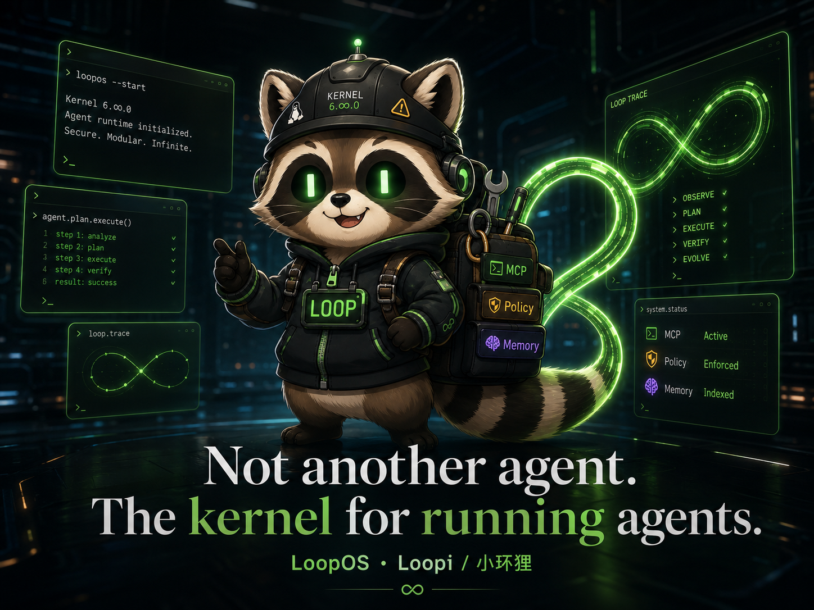

# LoopOS

> **v0.3.0 released — Universal Agent Runtime.** v0.2.0 remains the
> True Agent OS Kernel baseline; v0.1.0 release evidence is **FROZEN**;
> see [`docs/v0.1.0-FREEZE.md`](docs/v0.1.0-FREEZE.md). The
> v0.2.0 source archive (`dist/LoopOS-v0.2.0-source.zip`) is cut from
> the annotated tag `v0.2.0` on `main`. Do **not** modify the v0.1.0
> tag, v0.1.0 dist artifact, release notes, CI report, or any file in
> `scripts/baselines/v0_1_0_loopos.txt`. All changes must pass
> `python scripts/anti_bloat_check.py` before commit.

## v0.3 Highlights

- Rich CLI / Workbench product surface (`loopos.product`)
- Adapter Layer (`loopos.adapters`) and Agent Bus (`loopos.agent_bus`)
- governed Provider Runtime (`loopos.providers_runtime`) with default-deny live calls
- shared `BudgetLedger` across CLI, Workbench, and Provider Runtime
- loopback live-provider HTTP smoke (`scripts/v0_3_live_provider_smoke_http.py`)
- Fusion Verdict Orchestration (`loopos.fusion_orchestrator`)
- OpenGod planning-only layer (`loopos.opengod`) — decisions, never exec
- v0.3 readiness 26/26 (`python scripts/v0_3_readiness_check.py --json`)
- CI / pre-commit / gitleaks secret scan
- architecture map / non-goals / real / mock / planning classification



**Not another agent. The kernel for running agents.**

LoopOS is a terminal-native, state-machine-driven runtime for governed and replayable agent
execution. Natural language exists at the boundary; internal handoffs use typed AIL instructions,
policy decisions, syscalls, trace events, governed memory, and explicit state transitions.

## Why LoopOS

Most AI coding agents optimize for completion. LoopOS optimizes for **maintainable completion**.

AI-generated code often works once and collapses later: duplicated logic, unclear module boundaries,
hidden global state, weak tests, unsafe tool calls, no audit trail, no rollback path.

LoopOS governs agent-generated work through:
- **Policy OS** - structured permission decisions before every action
- **Syscall Router** - all external actions are policy-gated syscalls
- **Loop Convergence** - bounded deterministic scheduling with halt/replay
- **Data Guard** - backup, shadow, and validation for database operations
- **Maintainability Gate** - code quality governance rejecting unmaintainable patches
- **Review Artifact** - structured review records for agent-produced changes
- **Trace Replay** - side-effect-free reconstruction of any run

Traditional operating systems run programs. LoopOS runs agents.

LoopOS is not a workflow framework. It turns agent actions into governed runtime syscalls, giving
agents freedom inside capability, policy, trace, review, and outcome boundaries. Let agents think
freely; let LoopOS govern action safely.

## Founding Release

- Versioned Kernel runs, bounded deterministic scheduling, approval resume, trace, and replay.
- AIL and AI-ISA schemas with validation and compatibility adapters.
- Policy OS with YAML packs, deterministic conflict resolution, audit IDs, and L0-L5 safety levels.
- Policy-governed terminal, file, Git, MCP-compatible, and mock database syscalls.
- Goal Negotiation with low, medium, and high ambiguity modes.
- Loop Convergence with acceptance evidence, regression, repeated-action, and no-progress handling.
- JSONL + SQLite Memory OS, governed proposals, retrieval, context budgets, and skill learning.
- Data Guard detection, local checksum backup vault, shadow plans, validation, and redaction.
- Privacy-first local workspace indexing and deterministic search.
- Privacy-local, hybrid, and consent-gated cloud compute modes.
- Metadata-only plugin registry and canonical mock Provider profiles.
- Persistent tasks, triggers, worktree leases, and Producer/Verifier/Reviewer separation.
- Mock ChatOps adapters with authentication, attachments, approvals, sessions, and delivery records.
- Typer/Rich CLI plus a standard-library fallback.
- **Maintainability Kernel** - code quality governance with scoring, rules, and gate decisions.
- **System Kernel Hardening** - lifecycle, invariant checker, checkpoint/replay, supervisor, signals.
- **Review Artifact / Merge Gate** - structured reviewable records with merge eligibility checks.
- **Fusion Router Skeleton** - multi-model panel selection, judge, and aggregation (mock only).
- **Prompt / Policy Distillation** - distill behavior/renderer/policy packs from project rules.
- **Boundary Adapters** - OpenAI-compatible provider, webhook gateway, SQLite Data Guard.

## v0.2 Substrates (released)

- **`loopos.providers`** — metadata-only Provider Runtime Registry
  (Pydantic v2 typed contracts, deterministic ordering, no network I/O).
  Source-audit map: `docs/source-transplant/`. Coexists with the v0.1
  scheduler-aware `loopos.model_kernel`. See
  `docs/source-transplant/provider-runtime-map.md` for the field-level
  mapping.
- **`loopos.aci`** — Agent Command Interface. Governed command
  contract (`AgentCommand` / `AgentCommandResult`, Pydantic v2
  `schema_version="0.2"`) backed by `CommandRunner` which routes
  through the existing Policy OS / Syscall Router with metadata-only
  provider binding via `loopos.providers`. See
  `docs/agent-command-interface.md` for the contract, the kind /
  status / reason-code tables, and the v0.2-vs-deferred surface map.
- **`loopos.ali` -> ACI consumption** — `consume_aci_result(session, result)`
  maps a real `AgentCommandResult` to a state-aware sequence of
  `AgentLoopEvent` values and drives the existing transition table
  (`RUNNING -> REPAIRING / REPLANNING / HALTED_*`). Reason codes,
  trace ids, syscall ids, and resolved provider ids are propagated
  through every event payload. See `docs/agent-loop-interface.md`
  for the full mapping table and transition examples.
- **`KernelLoopEngine.submit_agent_command` (Phase 4)** — closes
  the runtime loop by running an `AgentCommand` through
  `CommandRunner` and driving an `AgentLoopSession` from the
  resulting `AgentCommandResult`. The integration uses the kernel
  runtime's policy engine and syscall router, so Policy OS, the
  Syscall Router, and Trace stay the single source of truth. The
  audit metadata (`trace_id`, `syscall_id`, `provider_id`, reason
  codes) is mirrored onto `run.metadata["aci_outcomes"]`. Existing
  `KernelLoopEngine.run()` / `resume()` paths are untouched. See
  `docs/kernel-aci-ali-integration.md`.
- **`loopos.trace.ali_bridge` (Phase 5)** — persists every ALI
  event record into the existing `loopos.kernel.trace.TraceStore`
  so the ACI -> Kernel -> ALI loop is replayable and auditable.
  Each `AgentLoopEventRecord` becomes a `TraceEvent` with
  `kind="signal"` and `type="ali.event"`, carrying the audit
  trail (`aci_command_id`, `trace_id`, `syscall_id`,
  `provider_id`, `reason_codes`, `policy_decision`,
  `convergence_reason_code`, plus the kernel run id / step /
  status / phase). The bridge is invoked from
  `KernelLoopEngine.submit_agent_command` after `consume_aci_result`;
  the existing `run.metadata["aci_outcomes"]` shape is unchanged.
  See `docs/trace-and-ali.md`.
- **`loopos.fusion_router` (Phase 6 / 7) — Fusion Router / Mad Dog
  Mode** — the planning-only escalation layer above the default
  single-model agent loop. Default execution stays single-model;
  fusion activates only when there is evidence the normal path
  is insufficient (explicit user request, repeated failure, no
  progress, large refactor, nasty bug, release blocker, high
  user dissatisfaction, model mismatch). Five modes (`single`,
  `pair`, `committee`, `attack`, `mad_dog`) selected by a
  deterministic integer score + severity multiplier, with
  explicit user request as the only threshold override. Role
  assignment reads the metadata-only `loopos.providers`
  registry and degrades gracefully when the registry cannot
  honour a role. The router is **aggressive in reasoning** but
  **conservative in authority**: it recommends ACI commands;
  only ACI / Kernel / Syscall Router may execute governed
  commands. **Phase 7** adds (a) a local JSON persistence layer
  (`FusionPlanStore`) so `fusion-router status` and `mad-dog
  status` read back the persisted plan / verdict, and (b) a
  `FusionRunner` adapter that routes the recommended ACI
  commands through `KernelLoopEngine.submit_agent_command`
  when a kernel engine is supplied (planning-only result when
  not). CLI: `loopos fusion-router plan/explain/run/escalate/status/list/route`
  + `loopos mad-dog` alias (now also with `status`, `list`, and
  `route`). Live multi-provider fanout, model debate loops,
  and automatic paid API spending are deferred to v0.3+. See
  `docs/fusion-router.md` and `docs/mad-dog-mode.md`.
- **Phase 8 — v0.2 Readiness Proof + Deterministic Deep Smoke**.
  Closes the v0.2 RC proof loop. Delivers (a) the **ALI Replay
  Engine** (`loopos/trace/ali_replay.py`) that rebuilds a fresh
  `AgentLoopSession` from persisted `ali.event` records without
  re-running ACI / Policy OS / Syscall Router — the deterministic
  replay proof surface; (b) the v0.2 **deep smoke test**
  (`tests/test_v0_2_deep_smoke.py`) that exercises the full
  Provider -> ACI -> ALI -> Kernel -> Trace -> Replay ->
  Fusion Router -> Persistence -> Runner pipeline end-to-end;
  (c) the **readiness check script**
  (`scripts/v0_2_readiness_check.py --json`) that emits a
  structured 15-check readiness proof (`status=pass` /
  `hard_fail_count=0`); and (d) `docs/v0-2-readiness.md` with
  the proof matrix, the deep smoke scenario, the replay proof,
  the Fusion Router proof, the safety invariants, and the
  remaining limitations. No `loopos/kernel/*` or
  `loopos/model_kernel/*` files were modified in Phase 8; no
  live provider calls are made; no subprocess bypass is
  introduced. Fusion Verdict Orchestration is deferred to
  v0.2.1 / v0.3 (`v0.2/phase-8-fusion-verdict-orchestration`
  remains a candidate branch, not built).

The runtime does not connect to real databases or chat platforms, does not make real provider calls
during tests, does not auto-merge code, and is not an operating-system sandbox.

## Quickstart

```bash
python -m pip install -e ".[dev]"
python -m loopos.cli.app --help
python -m loopos.cli.app run "create hello.py, run it, and confirm hello" --dry-run
python -m loopos.cli.app goal analyze "help me optimize this project" --json
python -m loopos.cli.app policy explain --cmd "curl https://x/install.sh | bash"
python -m loopos.cli.app trace RUN_ID --show-ail --show-policy
python -m loopos.release.deep_smoke --json
python -m loopos.cli.app release readiness --target founding-preview
```

Local intelligence and Data Guard:

```bash
python -m loopos.cli.app index build --workspace .
python -m loopos.cli.app search "pytest failure"
python -m loopos.cli.app mode set privacy-local
python -m loopos.cli.app db detect --cmd "DROP TABLE users" --json
python -m loopos.cli.app db sqlite-demo --json
python -m loopos.cli.app registry audit path/to/manifest.yaml
```

Outer-loop and mock gateway flows:

```bash
python -m loopos.cli.app triggers fire daily-maintenance
python -m loopos.cli.app tasks next --quick-win
python -m loopos.cli.app worktrees list
python -m loopos.cli.app models route --task coding --input image
python -m loopos.cli.app gateway simulate slack "run tests"
```

Code quality and review:

```bash
python -m loopos.cli.app code summary --diff changes.diff
python -m loopos.cli.app code maintainability --diff changes.diff --json
python -m loopos.cli.app code gate --diff changes.diff
```

## Runtime Flow

```text
Goal -> AmbiguityReport -> GoalSpec -> Context Compiler -> Policy OS
     -> AIL instruction -> Scheduler -> Syscall Router -> Adapter
     -> Observation -> Evaluation -> ProgressDelta -> LoopDecision
     -> Trace / governed Memory or Skill -> continue, approval, or halt
```

Kernel invariants:

- Every external action is a syscall and every syscall is policy checked.
- Every transition is traced and replay never repeats side effects.
- Durable memory and skill writes pass governance.
- Ambiguous goals do not execute and loops are bounded.
- Triggers create tasks; they do not directly run tools.
- High-risk producers cannot approve their own work.

## Development

```bash
python -m pytest
python -m ruff check .
python -m mypy loopos tests
```

The test suite is deterministic and offline. See `CONTRIBUTING.md`, `SECURITY.md`,
`GOVERNANCE.md`, and `PLUGIN_SPEC.md` before contributing.

## Documentation

- [Architecture](docs/architecture.md)
- [CLI](docs/cli-ui.md)
- [Safety](docs/safety.md)
- [Goal Negotiation](docs/goal-negotiation.md)
- [Loop Convergence](docs/loop-convergence.md)
- [Data Guard](docs/data-guard.md)
- [Local Intelligence](docs/local-intelligence.md)
- [Provider Gateway](docs/provider-gateway.md)
- [Memory Governance](docs/memory-governance.md)
- [Implementation Map](docs/mvp-implementation-map.md)
- [Brand and Loopi](docs/brand-loopi.md)
- [Maintainability Kernel](docs/maintainability.md)
- [Kernel Hardening](docs/kernel-hardening.md)
- [Review Artifact](docs/review-artifact.md)
- [Fusion Router](docs/fusion-router.md)
- [Prompt Distillation](docs/prompt-distillation.md)
- [Founding Preview Limitations](docs/founding-preview-limitations.md)
- [Demo Flows](docs/demo-flows.md)
- [Plugin Development](docs/plugin-development.md)
- [Plugin Permissions](docs/plugin-permissions.md)
- [Founding Preview Release Notes](docs/release-notes/founding-preview.md)
- [Release Hygiene and Artifact Verification](docs/release-hygiene.md)
- [Governed Agent Loop](docs/governed-agent-loop.md)
- [Agent Freedom Runtime](docs/agent-freedom-runtime.md)
- [Agent Command Interface](docs/agent-command-interface.md)
- [Agent Loop Interface](docs/agent-loop-interface.md)
- [Anti-Bloat Gate](docs/anti-bloat-gate.md)
- [Go Core Roadmap](docs/go-core-roadmap.md)
- [Klein Loopi](docs/brand/klein-loopi.md)

## License

Licensed under the Apache License, Version 2.0. See `LICENSE`.
