# LoopOS v0.3 — Architecture Map

> **Status (this document):** v0.3 architecture map. The
> Mermaid diagram, the real / dry-run / mock / planning-only
> classification table, and the v0.4 deferred-items list are
> the v0.3 source of truth for "what ships in v0.3, what is
> gated, what is mock-only, and what is deferred".

This document is the architecture map for the v0.3-alpha
release. It is the companion to ``docs/v0-3-non-goals.md``
(which lists what v0.3 does *not* ship). Together the two
documents define the v0.3 surface: this one says what is
present, the other says what is intentionally absent.

The architecture map is rendered as:

* a Mermaid component diagram (Section A) — the runtime
  shapes and the data flows between them.
* a layer table (Section B) — which package lives in which
  layer, with the boundary line marked.
* a real / dry-run / mock / planning-only classification
  table (Section C) — the v0.3 audit's Section C distilled
  to one table.
* a v0.4 deferred-items list (Section D) — the items the
  P0 + P1 hardening pass closes boundary decisions on but
  defers the implementation to v0.4.

The diagram is intentionally a **component diagram**, not
a sequence diagram: v0.3 is a state-machine-driven runtime
and the shape matters more than any one call path. The
detailed flow lives in the per-feature docs
(``docs/architecture-kernel.md``,
``docs/architecture-mvp.md``,
``docs/v0-3-readme.md``).

---

## A. Component diagram

```mermaid
flowchart TB
    %% --- User / External layer ---
    subgraph EXT["External"]
        USER[Operator / Developer]
        OPENAI[OpenAI-compatible endpoint]
        OLLAMA[Ollama daemon]
        SQLITE[SQLite / data dir]
    end

    %% --- CLI / FLI surface layer ---
    subgraph CLI["CLI / FLI surface (loopos.cli)"]
        APP["loopos.cli.app<br/>(Typer entry)"]
        FALLBACK["loopos.cli.fallback<br/>(argparse fallback)"]
        TYV03["loopos.cli.typer_v0_3<br/>(v0.3 commands)"]
        CMDS["loopos.cli.commands<br/>(pure command functions)"]
    end

    %% --- Product surface layer ---
    subgraph PROD["Product surface (v0.3)"]
        WB["loopos.product.Workbench<br/>(read-only orchestrator)"]
        CLUI["loopos.cli_ui<br/>(Rich rendering layer)"]
    end

    %% --- Authority-side runtime layer ---
    subgraph KERNEL["Authority-side runtime (v0.2 + v0.3 surface)"]
        KERN["loopos.kernel.KernelLoopEngine"]
        AIL["loopos.ail (AIL codec)"]
        POL["loopos.policy_os (Policy OS)"]
        SYS["loopos.syscalls (SyscallRouter)"]
        AGENT["loopos.agent_bus (Agent Bus)<br/>(PLANNING-ONLY on v0.3)"]
    end

    %% --- v0.3 product-only packages (planning-only / mock) ---
    subgraph V03PL["v0.3 product-only packages"]
        ADAPT["loopos.adapters<br/>(adapter layer, mock + spec)"]
        OPENGOD["loopos.opengod<br/>(PLANNING-ONLY, no authority)"]
        FUSION["loopos.fusion_router<br/>(orchestrator prototype)"]
    end

    %% --- Provider runtime layer ---
    subgraph PROV["Provider runtime (v0.3)"]
        REG["ProviderRuntimeRegistry"]
        MOCK["MockProviderRuntime"]
        OPENRT["OpenAICompatibleProviderRuntime"]
        OLLRT["OllamaProviderRuntime"]
        LEDGER["BudgetLedger<br/>(process-level singleton)"]
    end

    %% --- Skill + Memory layer ---
    subgraph MEM["Skill + Memory (v0.3)"]
        MSKILL["loopos.memory.skill_store<br/>+ skill_proposals"]
        SKILL["loopos.skills<br/>(MEMORY-BACKED re-export shim)"]
    end

    %% --- MCP layer (compat facade) ---
    subgraph MCP["MCP (compat facade, NOT production-wired)"]
        MCPR["loopos.mcp.router<br/>(ToolRouter)"]
        MCPT["loopos.mcp.types<br/>(ToolSpec, ToolCall, ...)"]
    end

    %% --- Data layer ---
    subgraph DATA["Data layer"]
        TRACE["Trace store (governed)"]
        REP["MemoryRepository"]
        SQL[("SQLite events.jsonl")]
    end

    %% --- User flow ---
    USER --> APP
    APP --> CMDS
    APP -.->|if Typer| TYV03
    APP -.->|if no Typer| FALLBACK
    FALLBACK --> CMDS
    TYV03 --> CMDS
    CMDS --> WB
    CMDS --> KERN
    APP --> CLUI

    %% --- Workbench flow ---
    WB --> KERN
    WB --> AGENT
    WB --> ADAPT
    WB --> OPENGOD
    WB --> FUSION
    WB --> CLUI
    WB --> REG
    WB --> LEDGER

    %% --- Kernel flow ---
    KERN --> AIL
    KERN --> POL
    KERN --> SYS
    KERN --> TRACE
    AIL --> POL

    %% --- Provider runtime flow ---
    REG --> MOCK
    REG --> OPENRT
    REG --> OLLRT
    OPENRT -.->|live, gated| OPENAI
    OLLRT -.->|live, gated| OLLAMA
    MOCK -.->|no live| OPENAI
    OPENRT --> LEDGER
    OLLRT --> LEDGER
    MOCK --> LEDGER

    %% --- MCP / Skills ---
    MCPR -.->|NOT wired in v0.3| KERN
    SKILL -.->|re-export shim| MSKILL

    %% --- Data persistence ---
    TRACE --> SQL
    REP --> SQL
    REP --> TRACE

    %% --- v0.3 call paths only ---
    OPENRT --> SQLITE
    OLLRT --> SQLITE
    KERN --> SQLITE

    classDef planning fill:#ffe4b5,stroke:#cc6600,color:#000
    classDef mock fill:#e0e0e0,stroke:#888,color:#000
    classDef gated fill:#fff2cc,stroke:#cc9900,color:#000
    classDef boundary stroke-dasharray: 4 2
    class OPENGOD,MCPR,SKILL planning
    class ADAPT,MOCK mock
    class OPENRT,OLLRT gated
```

The diagram is best read as four regions:

1. **External.** Operator input, optional OpenAI / Ollama
   endpoints, the SQLite data dir.
2. **CLI / FLI surface.** The Typer app and its argparse
   fallback. The v0.3 commands live in a dedicated module
   (``loopos.cli.typer_v0_3``) so the entry-point file
   stays small.
3. **Authority-side runtime.** The kernel loop, the AIL
   codec, the Policy OS engine, the syscall router, and
   the v0.3 agent bus. These components own authority
   (they issue syscalls, gate state transitions, write to
   the trace store). The agent bus is planning-only on
   v0.3 — the bus is a layer, not a side-effect actor.
4. **v0.3 product-only packages.** Adapters, OpenGod,
   fusion orchestrator. These packages do not own
   authority; they are surfaced through the Workbench and
   the CLI. OpenGod is planning-only (no kernel
   consumption); the fusion orchestrator is caller-driven
   (no background scheduler).

MCP and skills are deliberately drawn as dashed
boundaries. MCP is present but not production-wired
(``loopos.mcp`` → ``loopos.syscalls`` is reachable but
``KernelLoopEngine._SYSCALLS`` does not include
``TOOL.CALL``). Skills are memory-backed
(``loopos.skills`` is a re-export of
``loopos.memory.skill_store`` /
``loopos.memory.skill_proposals``).

---

## B. Layer table

| Layer | Package | Authority | v0.3 status |
| ----- | ------- | --------- | ------------ |
| CLI / FLI | ``loopos.cli.app`` | none | Typer entry; v0.3 commands extracted to ``loopos.cli.typer_v0_3`` |
| CLI / FLI | ``loopos.cli.fallback`` | none | argparse fallback; no behaviour change |
| CLI / FLI | ``loopos.cli.typer_v0_3`` | none | v0.3 Typer bindings (7 commands) |
| CLI / FLI | ``loopos.cli.commands`` | none | Pure command functions used by Typer and argparse |
| Product | ``loopos.product`` | none | Read-only Workbench, no side effects, default --dry-run |
| Product | ``loopos.cli_ui`` | none | Rich rendering layer; no I/O |
| Authority | ``loopos.kernel.loop_engine`` | **yes** | v0.2 kernel; v0.3 does not add new syscalls |
| Authority | ``loopos.ail`` | **yes** | AIL codec; v0.3 does not add new ops |
| Authority | ``loopos.policy_os`` | **yes** | Policy OS engine; v0.3 reuses v0.2 packs |
| Authority | ``loopos.syscalls`` | **yes** | Syscall router; v0.3 maps the 5 v0.2 syscalls |
| Authority (v0.3) | ``loopos.agent_bus`` | **yes (planning-only on v0.3)** | Translates events → governed commands; no direct bypass |
| v0.3 product | ``loopos.adapters`` | none | Adapter interface; default mock; cleanroom spec |
| v0.3 product | ``loopos.providers_runtime`` | partial (live path is gated) | Mock + OpenAI + Ollama; ``BudgetLedger`` is process-singleton |
| v0.3 product | ``loopos.opengod`` | none | Planning-only; never executes; never opens a file |
| v0.3 product | ``loopos.fusion_router`` | none | Verdict orchestrator; caller-driven; no scheduler |
| Compat | ``loopos.mcp`` | none | ToolRouter facade; **not** wired into ``_SYSCALLS`` on v0.3 |
| Compat | ``loopos.skills`` | none | Re-export shim of ``loopos.memory.skill_*`` |
| Memory | ``loopos.memory`` | none | Skill store, proposals, events, repos; v0.2 + v0.3 surface |
| Data | ``loopos.trace`` | **yes** | Governed trace store; v0.3 surface reused |
| Data | ``loopos.memory.repository`` | **yes** | Memory repository; indexes trace events |

**Authority rule.** A package is *authority-bearing* if it
can issue a syscall, gate a state transition, or write a
governed memory event. The v0.3 product packages are
explicitly *not* authority-bearing: the Workbench, the
adapters, OpenGod, the fusion orchestrator, the MCP
facade, the skills shim, and the CLI surface all observe
state and produce evidence; they do not change the
runtime's authority contract.

---

## C. Real / dry-run / mock / planning-only classification

The v0.3 audit (`docs/reports/v0-3-alpha-split-audit.md`
Section C) classifies every v0.3 feature into one of four
buckets. The classification matters because it bounds
what the test suite proves and what production code can
rely on.

| Classification | Meaning | v0.3 examples |
| -------------- | ------- | -------------- |
| **Real** | End-to-end in production, gated by a documented safety contract. Wire-level HTTP to a real endpoint, real policy check, real budget ledger. | ``OpenAICompatibleProviderRuntime`` (gated live: ``live_provider_calls_allowed=True`` + ``OPENAI_API_KEY`` + ``--budget-usd`` + ``--confirm``); ``OllamaProviderRuntime`` (same gating). The P0-2 loopback HTTP smoke proves the wire path end-to-end. |
| **Dry-run** | No side effects; returns a structured "would-do" payload. The default surface for user-facing commands. | ``loopos workbench`` (``dry_run=True`` by default); ``loopos model call`` (``dry_run=True` by default); ``providers_runtime.openai`` (``live_provider_calls_allowed=False`` returns ``status="dry_run"``). |
| **Mock** | In-process, deterministic, never touches the network. Used by the test suite and the default Workbench render. | ``MockProviderRuntime`` (in-process echo); ``loopos/adapters/mock.py`` (fixed event stream); ``loopos/adapters/hermes.py`` / ``scream_code.py`` / ``cleanroom.py`` (default ``simulated=True``). |
| **Planning-only** | Emits a structured decision; never executes. No side effects on the runtime. | ``loopos.opengod`` (``OpenGodDecision`` + ``OpenGodVerdict``, no execution); ``loopos.fusion_router.orchestrator`` (caller-driven ``FusionVerdictOrchestrator``, no background scheduler). |

### C.1 What is *not* classified

* The ``loopos.cli`` surface is *user-facing*, not
  classified. The CLI issues real, dry-run, mock, or
  planning-only calls depending on the arguments.
* ``loopos.kernel.loop_engine`` is the *authority*; it is
  not classified. Every authority-bearing call is one of
  the four classifications above; the kernel itself is
  the envelope.
* ``loopos.trace`` and ``loopos.memory.repository`` are
  *storage*; they are not classified. They are the durable
  surface that all four classifications write to.

### C.2 Why this matters for the v0.3 → v0.4 transition

The v0.4 work may re-classify a surface upward
(mock → real, planning-only → authority-bearing) but
never downward. Specifically:

* A v0.3 mock adapter cannot silently become a real
  adapter on v0.4; the v0.3 mock is what the test suite
  relies on. A new real adapter lands as a new file.
* A v0.3 planning-only surface (OpenGod) cannot silently
  become authority-bearing; the boundary check
  ``check_opengod_planning_only_boundary`` fails
  explicitly. The v0.4 OpenGod → AIL bridge must
  re-shape the boundary check or remove it.

The classification table is part of the v0.3 contract.
A change to the table is a v0.4 RFC.

---

## D. v0.4 deferred items

The P0 + P1 hardening pass closes boundary decisions on
the following items. None of them ship in v0.3; all of
them are explicit v0.4 work.

### D.1 OpenGod → AIL authority bridge

Documented in ``docs/v0-3-opengod-boundary.md``. v0.4 plan:

* Map ``OpenGodDecision.kind`` → one or more
  ``AILInstruction`` ops. The natural mapping is:
  * ``HALT`` → ``LOOP.HALT``
  * ``REFINE`` → ``AILPreference``
  * ``SCALE`` → ``TERM.EXEC`` with bounded scope
  * ``ACCEPT`` → no-op
* Wire the bridge into
  ``KernelLoopEngine.compile_next_ail()`` behind a
  ``LOOPOS_OPENGOD_AUTHORITY=1`` feature flag; off by
  default.
* Add a kernel-loop test that injects a stub
  ``OpenGodDecision`` and asserts the loop honors it.
* Update the v0.3 boundary check to record the bridge as
  shipped.

### D.2 Cross-path budget ledger reinforcement

The P0-1 ``BudgetLedger`` is process-level. v0.4 will:

* Add a persistent ledger backend (SQLite-backed) so
  spend survives process restart.
* Add per-session rate limits (token bucket per
  provider + model + session).
* Add per-provider model-version accounting so a model
  upgrade resets spend correctly.

### D.3 Governed MCP Gateway

Documented in ``docs/v0-3-mcp-boundary.md``. v0.4 plan:

* Wire ``TOOL.CALL`` into
  ``KernelLoopEngine._SYSCALLS``.
* Define the ``TOOL.RESOLVE`` / ``TOOL.CALL`` /
  ``TOOL.RESULT`` AIL op family.
* Add a governance layer: per-tool approval memory,
  per-session allow-lists, per-tool rate limits.
* Define a redaction contract on tool call args /
  results.
* Add an audit trail: every tool call lands in the
  governed trace store with redaction.

### D.4 Full Skill Governance

Documented in ``docs/v0-3-skills-boundary.md``. v0.4 plan:

* Move ``loopos/memory/skill_store.py`` and
  ``loopos/memory/skill_proposals.py`` into
  ``loopos/skills/`` and re-export from ``loopos/memory/``
  for back-compat.
* Define a skill lineage contract
  (``parent_skill_id``, ``derived_from_skill_ids``,
  supersession history).
* Define a skill scoring contract (per-proposal confidence
  score with reasons; off by default).
* Add a skill dispatch hook: define how the kernel loop
  consults the skill store on a ``GOAL`` event; off by
  default.
* Add a skill-versioning policy.

### D.5 CI workflow + pre-commit hardening

The P0-3 CI workflow and pre-commit config wire the
*gating* but do not gate the v0.3 release on every check.
v0.4 will:

* Make the v0.3 readiness check a required CI step.
* Add a mutation testing job (mutmut) on the five
  highest-risk v0.3 modules.
* Add a secret-scan job (gitleaks) with a fail-on-leak
  policy.
* Add an SBOM generation step (cyclonedx-py).

### D.6 loopos/cli/app.py size

The P1-4 extraction moves the v0.3 Typer bindings into
``loopos.cli.typer_v0_3``. ``app.py`` is still 654 lines
(after the extraction), above the 300-LOC anti-bloat
soft cap. v0.4 will:

* Extract the remaining v0.2 Typer bindings into
  ``loopos.cli.typer_v0_2``.
* Move the runtime commands (``run``, ``resume``,
  ``status``, ``history``, ``step``, ``replay``, ``repl``,
  ``trace``, ``tools``) into a ``loopos.cli.typer_runtime``
  module.
* Target: ``loopos/cli/app.py`` below 200 LOC.

### D.7 API reference + architecture diagram consolidation

The P1-6 pass adds ``docs/architecture-v0-3.md`` (this
document) and ``docs/v0-3-non-goals.md``. v0.4 will:

* Add an auto-generated API reference (mkdocstrings or
  sphinx).
* Consolidate the ~80-markdown v0.3 doc set into a
  single rendering pipeline.
* Add a per-package architecture diagram in
  ``docs/architecture/``.

### D.8 API stability + versioning

v0.3 ships with no API stability promise. v0.4 will:

* Mark public APIs with ``@stable`` / ``@experimental``
  decorators.
* Generate a CHANGELOG entry per stable API addition.
* Adopt a deprecation policy (3 minor versions
  before removal).

### D.9 Async + streaming provider runtime

The v0.3 provider runtime is synchronous. v0.4 will:

* Add ``asyncio`` support to
  ``OpenAICompatibleProviderRuntime`` and
  ``OllamaProviderRuntime``.
* Add a real Server-Sent Events transport for streaming
  responses.
* Update ``Workbench.call_model`` to support the
  streaming path behind a feature flag.

### D.10 Multi-tenant isolation

v0.3 is single-tenant. v0.4 will add per-tenant
isolation: per-tenant data dirs, per-tenant budget
ledgers, per-tenant trace indexes. The
``loopos.tenants`` package will be new in v0.4; it
does not exist on v0.3.

---

## E. Architecture invariants

The v0.3 architecture must hold under all v0.3 patches.
The P0 + P1 hardening pass enforces the following
invariants via the v0.3 readiness check.

| Invariant | Enforced by |
| --------- | ----------- |
| Authority-bearing code does not silently grow new AIL ops. | ``check_opengod_planning_only_boundary`` (kernel / ail / agents / agent_bus do not import OpenGodDecision for execution). |
| Skills are memory-backed and do not silently grow a v0.4 governance surface. | ``check_skills_memory_backed_boundary`` (no SkillLineage / SkillScoring / SkillDispatcher in ``loopos.skills``). |
| MCP is present but not production-wired. | ``check_mcp_present_not_wired_boundary`` (TOOL.CALL not in ``KernelLoopEngine._SYSCALLS``). |
| The deep-smoke runner honors its timeout contract. | ``test_deep_smoke.py::test_deep_smoke_global_timeout_names_running_check`` (semantic + bounded-duration assertions, not wall-clock magic numbers). |
| Budget spend is counted once across paths. | ``tests/test_budget_ledger.py`` (Workbench + CLI land on the same ledger entry; dry-run and failed calls do not commit). |
| The loopback HTTP smoke proves the wire path. | ``check_loopback_http_smoke`` (5 invariants: dry-run, missing key, real HTTP, metadata, redaction). |

A future commit that breaks one of these invariants is a
**runtime contract regression** and must either (a) be
justified in the commit message with a documented
exception, or (b) update the invariant and the readiness
check in the same commit.

---

## F. End of document

The v0.3 architecture map is the v0.3 source of truth for
"what ships, what is gated, what is mock-only, and what is
deferred". The P0 + P1 hardening pass does not change the
map; it adds the boundary decisions, the
real / dry-run / mock / planning-only classification, the
v0.4 deferred-items list, and the architecture invariants.
The v0.4 release notes will record the changes.

End of v0.3 architecture map.