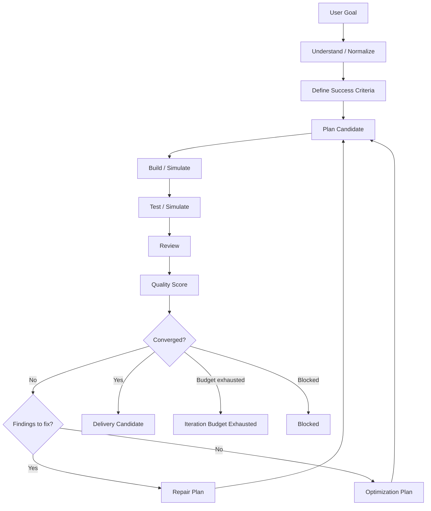

# Core Loop

> The Project Training core loop:
> **Goal → Plan → Build → Test → Review → Repair → Optimize → Repeat → Deliver.**

This document is the canonical walkthrough of the v0.4.0 core loop.
For the product thesis, see
[Project Training Loop](project-training-loop.md) and
[Loop Engineering Runtime](loop-engineering-runtime.md). For module
layering, see [v0.4 Architecture](v0-4-architecture.md).

## 0. The complete loop

```text
Goal                          (UserGoal / ProjectObjective)
  → Plan                      (PlanCandidate, source ∈ {planner, repair, optimizer, fusion})
  → Build                     (BuildResult, status ∈ {simulated, applied, failed, skipped})
  → Test                      (TestResult, status ∈ {passed, failed, partial, not_run, simulated})
  → Review                    (list[ReviewFinding], 10 categories)
  → Repair                    (RepairPlan, optional)
  → Optimize                  (OptimizationPlan / OptimizationStep, optional)
  → Score                     (QualityScore, 6 dimensions + overall)
  → Convergence               (ConvergenceReport, status ∈ {continue, deliver, blocked, iteration_budget_exhausted})
  → Repeat                    (next TrainingIteration, until converge)
  → Deliver                   (DeliveryCandidate, requires evidence + no fake convergence)
```

The full v0.4.0 loop runs the nine phases plus a convergence decision
and a delivery decision, all under the framing of a **project
training loop**: each iteration is a forward pass, the loss is the
gap, the evaluation signals are the findings, the optimizer proposes
the next step, the adversarial evaluator prevents fake convergence,
and the loop checkpoints between iterations.

## 1. The phases

The loop is composed of eleven named phases (nine forward, two
meta). Each phase produces **typed data** that the next phase
consumes. The shape of the data is the loop's source of truth —
no phase is a black box.

| # | Phase | Input | Output | Module |
|---|-------|-------|--------|--------|
| 1 | **Goal** | `UserGoal.raw_goal` | `UserGoal` / `ProjectObjective` | `loop_engine.goal` |
| 2 | **Plan** | `LoopState`, prior signals | `PlanCandidate` | `loop_engine.planner` |
| 3 | **Build** | `PlanCandidate` | `BuildResult` | `loop_engine.builder` |
| 4 | **Test** | `BuildResult`, `SuccessCriteria` | `TestResult` | `loop_engine.tester` |
| 5 | **Review** | `LoopState`, plan, build, tests | `list[ReviewFinding]` | `loop_engine.reviewer` |
| 6 | **Repair** | findings, tests | `RepairPlan \| None` | `loop_engine.repair` |
| 7 | **Optimize** | state, signals, loss | `OptimizationStep \| None` | `loop_engine.optimizer` |
| 8 | **Score** | state, build, tests, findings | `QualityScore` | `quality.scorer` |
| 9 | **Convergence** | state, quality, signals | `ConvergenceReport` | `quality.convergence` |
| 10 | **Repeat / Halt** | `ConvergenceReport` | next `TrainingIteration` or halt | `loop_engine.loop` |
| 11 | **Deliver** | `LoopState` | `DeliveryCandidate` | `quality.delivery` |

Each numbered phase is implemented in `loopos.loop_engine` (or
`loopos.quality` for 8–9 and 11). The shapes are:

* **Plan (2):** `PlanCandidate` — the proposed next forward pass.
* **Build (3):** `BuildResult` — the executed forward pass.
* **Test (4):** `TestResult` — the empirical loss measurement.
* **Review (5):** `list[ReviewFinding]` — the base evaluator's
  findings, which become `EvaluationSignal` records.
* **Repair (6):** `RepairPlan | None` — the next forward pass's
  plan when the previous one failed.
* **Optimize (7):** `OptimizationStep | None` — the next forward
  pass's plan when the loss is high but there is no actionable bug.
* **Score (8):** `QualityScore` — the deterministic loss
  measurement for the iteration.
* **Convergence (9):** `ConvergenceReport` — the convergence
  decision, including the explicit list of `FakeConvergenceFinding`
  records.
* **Repeat / Halt (10):** the loop's branching, driven by
  `ConvergenceReport.status` and the iteration budget.
* **Deliver (11):** `DeliveryCandidate` — the trained project, with
  evidence and known limitations.

## 2. Flowchart



## 3. What each phase guarantees

### 3.1 Understand

The raw goal string is normalized into a `UserGoal` with explicit
`constraints` and `preferences`. This is deterministic and offline;
no LLM is invoked in v0.4.0.

### 3.2 Define Success Criteria

Success criteria are generated from the goal. They include both
`required` items (which block delivery) and `optional` items (which
contribute to the quality score).

### 3.3 Plan

The planner emits a `PlanCandidate` with steps, rationale, expected
outcomes, and risks. If the previous iteration produced findings, the
planner's `source` is `repair` or `optimization`, and the steps
explicitly address the prior findings.

### 3.4 Build

In v0.4.0 the builder is **simulated** by default: it produces a
`BuildResult` with `status="simulated"`, a deterministic `summary`,
and a placeholder for `changed_files`. Real executors can be plugged
in by implementing `LoopBuilder.build()`.

### 3.5 Test

The tester evaluates `BuildResult` against `SuccessCriteria`. It
returns a `TestResult` with `passed` / `failed` / `skipped` counts and
per-failure messages. The result includes `status="simulated"` until
a real runner is wired in.

### 3.6 Review

The reviewer produces a list of `ReviewFinding` items drawn from
`ReviewCategory` — 10 categories, none of which are required to be
security. Findings carry `severity`, `claim`, `evidence`, and
`blocks_delivery`.

### 3.7 Repair

If a finding has actionable evidence, the repair engine produces a
`RepairPlan` whose steps reference the source finding IDs.

### 3.8 Optimize

The optimizer scans for improvement opportunities beyond repair —
typically `user_goal_mismatch` (low `goal_alignment`) or design-level
issues that the repair engine does not cover.

### 3.9 Score

The `QualityScorer` produces a `QualityScore` with six dimensions
and a weighted overall. The weights are:

```text
overall = 0.30 * goal_alignment
        + 0.25 * test_health
        + 0.20 * defect_health
        + 0.10 * design_health
        + 0.05 * documentation_health
        + 0.10 * delivery_readiness
```

### 3.10 Decide

The `ConvergenceEngine` returns a `ConvergenceStatus` of
`continue`, `deliver`, `blocked`, or `iteration_budget_exhausted`.
Required criteria, blocking findings, and the quality threshold all
contribute.

### 3.11 Deliver

The `DeliveryEngine` evaluates the final `LoopState` and emits a
`DeliveryCandidate` with `summary`, `evidence`, `quality_score`,
`known_limitations`, `open_risks`, and `ready`. `ready=True` requires
evidence — not just "the loop finished".

## 4. State carried between iterations

`LoopState` carries:

- the original `UserGoal`
- the `SuccessCriteria`
- the list of `LoopIteration` records
- `current_status` (initialized / running / ready_to_deliver /
  blocked / failed)
- `max_iterations`
- `trace_id`

Every iteration appends a fully-populated `LoopIteration` to
`state.iterations` — there is no silent overwrite.

## 5. Termination conditions

The loop terminates when **any** of these are true:

1. `ConvergenceStatus.status == "deliver"`.
2. `ConvergenceStatus.status == "iteration_budget_exhausted"`.
3. `ConvergenceStatus.status == "blocked"`.
4. An unrecoverable exception is raised (caught and recorded as
   `current_status="failed"`).

## 6. Simulated vs real

Every executor in v0.4.0 supports a `dry_run` mode. In simulated
mode:

- `BuildResult.status = "simulated"`
- `TestResult.status = "simulated"` (or `"partial"` after a real test
  reports failures)
- The data flow is real: failures still produce findings, findings
  still produce repair plans, repair plans still change the next
  plan candidate.

A real executor backend can be plugged in by implementing the
respective protocol (`LoopBuilder`, `LoopTester`, …). The
`LoopEngine` itself does not change.

## 7. Related reading

- [Loop Engineering Runtime](loop-engineering-runtime.md)
- [v0.4 Architecture](v0-4-architecture.md)
- [Quality Engine](quality-engine.md)
- [Convergence and Delivery](convergence-and-delivery.md)
- [Action Boundary](action-boundary.md)
