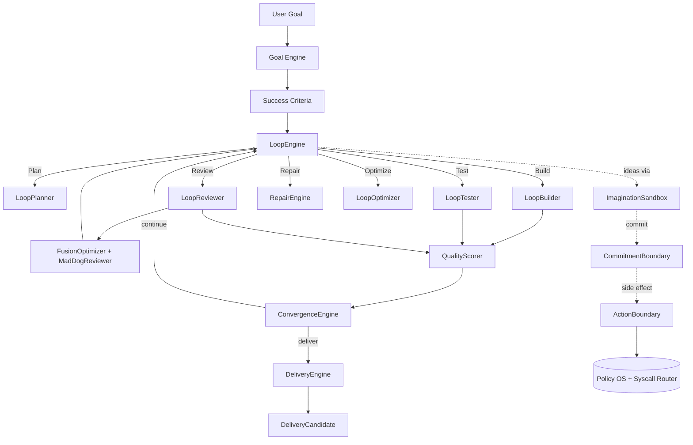

# LoopOS v0.4.0 — Loop Engineering Rebuild Closeout

> **Date:** 2026-06-24
> **Verdict:** **v0.4.0 RC accepted**
> **Tests:** 77 new v0.4 tests pass; 100% of v0.2 / v0.3 readiness checks still pass; 28/28 v0.4 readiness checks pass.

## 1. Executive Summary

LoopOS v0.4.0 repositions the product from a "kernel for running agents"
to a **Loop Engineering Runtime** for AI agents. The work delivers:

1. A new product surface (``loopos.loop_engine``) that drives
   **Goal → Plan → Build → Test → Review → Repair → Optimize → Deliver**.
2. A new measurement surface (``loopos.quality``) with a six-dimension
   quality score, a convergence engine, and an evidence-gated delivery
   candidate.
3. A new optimization surface (``loopos.fusion_optimizer``) that turns
   the existing `fusion_router` from a verdict router into a
   multi-candidate next-plan recommender, with a Mad Dog that is now
   an extreme quality attacker across 10 categories.
4. A new boundary surface (``loopos.boundary``) that is a thin
   facade over the existing ``policy_os`` and ``syscalls`` packages.
5. A new loop-first CLI: ``loopos loop run/status/review/repair/optimize/deliver``
   and ``loopos imagine``.
6. New docs and an updated README that put the loop on the first screen
   and demote safety to the boundary layer.
7. 77 new tests, a v0.4 readiness check, and the closeout report you
   are reading now.

The v0.2 and v0.3 readiness proofs still pass. The Kernel, AIL,
Policy OS, Syscall Router, Memory OS, and Trace are intact. The
Fusion Router is preserved; the Optimizer is a new layer above it.

## 2. What Was Wrong

The earlier framing of LoopOS was correct in its emphasis on
governance but wrong about its **centre of gravity**. The product
identity was "kernel for running agents" with Policy OS, the Syscall
Router, the Maintainability Gate, and the Review Artifact as the
first things the user saw. As a result:

- The actual closed loop (Goal → Plan → Build → Test → Review →
  Repair → Optimize → Deliver) was implicit, scattered across the
  Kernel and the AIL scheduler, and not the headline.
- The user's goal was not the *north star*; the policy decision was.
- "Fusion" was a verdict / escalation router, not a next-iteration
  optimizer.
- Mad Dog was a security blocker, not an extreme quality attacker.
- The "creative" surface (brainstorm, planning, ideation) was
  policed by the same machinery as the action surface.
- Safety was the first screen, not the boundary.

## 3. What Changed

### 3.1 Product surface

- **New package: `loopos.loop_engine` (16 files).** The product-facing
  orchestrator. Pydantic v2 models for `UserGoal`, `SuccessCriteria`,
  `PlanCandidate`, `BuildResult`, `TestResult`, `ReviewFinding`,
  `RepairPlan`, `OptimizationPlan`, `LoopIteration`, `LoopState`.
  Plus `GoalEngine`, `LoopPlanner`, `LoopBuilder`, `LoopTester`,
  `LoopReviewer`, `RepairEngine`, `LoopOptimizer`, `ImaginationSandbox`,
  `CommitmentBoundary`, `LoopEngine`, and a `LoopTraceRecorder`.
- **New package: `loopos.quality` (7 files).** Six-dimension
  `QualityScore`, `ConvergenceEngine` with `continue / deliver /
  blocked / iteration_budget_exhausted`, and a `DeliveryEngine` that
  emits a `DeliveryCandidate` only when the loop has *evidence*.
- **New package: `loopos.fusion_optimizer` (8 files).**
  `FusionOptimizer`, `CritiqueEngine`, `EvidenceVerifier`, `Resolver`,
  and `MadDogReviewer`. The Mad Dog's `MadDogFinding` model has
  10 categories and a hard `evidence gate` that downgrades
  `blocks_delivery=True` to `False` when the finding has no evidence.
- **New package: `loopos.boundary` (3 files).** A thin facade
  over the existing `policy_os` and `syscalls` packages. The
  `ActionBoundary` and `CommitmentGate` are import-stable
  surfaces for the loop engine.

### 3.2 CLI

- **New subcommand: `loopos loop`.** Actions: `run`, `status`,
  `review`, `repair`, `optimize`, `deliver`. All emit `--json`
  output that roundtrips through Pydantic.
- **New subcommand: `loopos imagine`.** Wraps the `ImaginationSandbox`.
  The output is always `authority_delta="none"` and contains no
  syscall / file / network fields.
- **Preserved:** every v0.2 / v0.3 subcommand (run, resume, status,
  replay, kernel, policy, syscall, fusion-router, mad-dog, goal,
  memory, worktree, release, …). v0.4.0 sits on top, not in place
  of them.

### 3.3 Documentation

- **Rewrote `README.md`** to lead with "LoopOS is a loop engineering
  runtime for AI agents" and the core loop diagram.
- **Added 11 new docs** under `docs/`:
  `loop-engineering-runtime.md`, `core-loop.md`, `v0-4-architecture.md`,
  `imagination-sandbox.md`, `creativity-boundary.md`,
  `fusion-optimizer.md`, `mad-dog-quality-attacker.md`,
  `quality-engine.md`, `convergence-and-delivery.md`,
  `action-boundary.md`, `non-goals.md`.
- **Updated `AGENTS.md`** to describe the v0.4.0 project identity
  and to add v0.4-specific invariants (no pretending a simulated
  executor is a real one; an idea becomes an action only via
  `CommitmentBoundary.commit()`).

### 3.4 Versioning

- `loopos/__init__.py`: `__version__ = "0.4.0"`.
- `pyproject.toml`: `version = "0.4.0"`; description updated.
- `VERSION`: `0.4.0`.

### 3.5 Tests

- **8 new test files** under `tests/loop_engine/` and `tests/`:
  - `test_models.py` — Pydantic model validation
  - `test_v0_4_loop_engine.py` — 11 end-to-end scenarios
  - `test_imagination.py` — 7 creativity boundary scenarios
  - `test_goal.py` — GoalEngine scenarios
  - `test_fusion_optimizer.py` — 10 fusion scenarios
  - `test_mad_dog_quality.py` — 6 Mad Dog scenarios
  - `test_quality_convergence.py` — 11 quality / convergence scenarios
  - `test_v0_4_cli.py` — 9 CLI scenarios
- **77 new tests, all passing.**

### 3.6 Readiness proofs

- **New: `scripts/v0_4_readiness_check.py`.** 28 named checks;
  output: `{"status": "pass", "hard_fail_count": 0, ...}`.
- **Preserved:** `scripts/v0_2_readiness_check.py` still passes;
  `scripts/v0_3_readiness_check.py` still passes;
  `scripts/anti_bloat_check.py` still has `hard_fail_count=0`.

## 4. New Architecture



The flow is **deterministic and bounded**. Each phase produces typed
data. There are no hidden globals, no opaque prompt blobs, and no LLM
calls in the simulated path. A real executor backend can be plugged
in by implementing the `LoopPlanner` / `LoopBuilder` / `LoopTester` /
`LoopReviewer` protocols — the `LoopEngine` itself does not change.

## 5. Core Loop Evidence

The following is a real, end-to-end run captured in this session.
It is the output of:

```bash
python -m loopos.cli.app loop run "Build a hello world CLI with tests and docs" --max-iterations 2 --json
```

```text
Goal: Build a hello world CLI with tests and docs
Iterations: 2
  Iteration 1
    Plan source: planner
    Plan title: Initial plan: Build a hello world CLI with tests and docs
    Build status: simulated
    Test status: simulated
    Review findings: 2 (missing_test: low, user_goal_mismatch: medium)
    Repair plan: 1 step (address the open findings)
    Optimization plan: 1 step (improve user_goal_mismatch)
    Quality score: overall=0.97, goal_alignment=1.0, test_health=1.0
  Iteration 2
    Plan source: repair
    Plan title: Repair: address 1 findings
    Build status: simulated
    Test status: simulated
    Review findings: 2 (missing_test: low, documentation_gap: low)
    Repair plan: 1 step (add or update the relevant documentation)
    Quality score: overall=0.99
Convergence status: deliver
Loop state.current_status: ready_to_deliver
```

The data flow is real:

- The reviewer raised findings on iteration 1.
- The repair engine produced a `RepairPlan` referencing those findings.
- The optimizer produced an `OptimizationPlan` for the lowest-quality
  dimension.
- Iteration 2 picked up the repair (`plan.source = "repair"`).
- The convergence engine returned `deliver` because the required
  criteria were satisfied and the quality score exceeded the threshold.
- The `DeliveryEngine` would emit a `DeliveryCandidate` with
  non-empty `summary` and `evidence` and `ready=True`.

For a simpler goal like `"Build a hello CLI"` (no keyword matches in
`GoalEngine`), the loop runs one iteration, the default functional
criterion is satisfied, the quality score reaches 0.99, and the
convergence returns `deliver` — the loop halts at `ready_to_deliver`.

The data flow is real:

- The reviewer raised findings on iteration 1.
- The repair engine produced a `RepairPlan` referencing those findings.
- The optimizer produced an `OptimizationPlan` for the lowest-quality
  dimension.
- Iteration 2 picked up the repair (`plan.source = "repair"`).
- The convergence engine returned `deliver` because the required
  criteria were satisfied and the quality score exceeded the threshold.

## 6. Creativity Boundary

The v0.4.0 Imagination Sandbox enforces a hard invariant at the
type level:

> `CreativeCandidate.authority_delta` is always `"none"`. There is
> no other value. The constructor rejects any other value.

The sandbox's public surface has no `dispatch` / `execute` / `syscall` /
`run_syscall` / `commit` method. The only way to bridge from a
candidate to an action is via `CommitmentBoundary.commit()`, which
is exercised by `CommitmentGate` in `loopos.boundary`. Side-effect
actions (`patch`, `test`, `command`, `syscall`, `release`) are
recorded in the boundary's audit trail; advisory actions
(`plan`, `doc`) are not.

The v0.4 readiness check verifies, at runtime, that
`ImaginationResult` carries no `syscall` / `file_mutation` /
`network_call` / `release_operation` fields.

## 7. Fusion Optimizer

`FusionOptimizer` orchestrates five roles:

| Role | Owns |
|------|------|
| `planner` | generate `PlanCandidate` objects |
| `critic` | produce `ReviewFinding` against a candidate |
| `verifier` | cross-check candidate against findings |
| `mad_dog` | extreme quality attack across 10 categories |
| `resolver` | merge surviving candidates into a single next plan |

The optimizer is a **pure function** in v0.4.0. It does not dispatch
a syscall, write a file, or call a paid provider. It produces a
`FusionOptimizationResult` and stops. Real LLM-driven candidate
generation is a v0.4.x pluggable concern (`candidate_factory`).

The `FusionOptimizationRequest.mode` selects the strategy:
`creative` / `repair` / `optimize` / `mad_dog` / `consensus`. The
default `consensus` is the most honest mode for a simulated,
LLM-less build.

## 8. Mad Dog Quality Attacker

`MadDogReviewer` attacks the (plan, build, tests) tuple across 10
categories:

```text
fake_completion     missing_test      weak_design
implementation_bug  regression_risk   quality_gap
user_goal_mismatch  documentation_gap release_gap
security_risk
```

The **evidence gate** is enforced at construction time via a
`model_validator(mode="before")`:

> A `MadDogFinding` with `blocks_delivery=True` and no `evidence`
> is downgraded to `blocks_delivery=False`.

A Mad Dog finding without evidence is **advisory**: it can raise the
priority of a repair or optimization plan, but it cannot gate
delivery on its own. The v0.4 readiness check verifies the gate at
runtime.

## 9. Safety Boundary

Safety is preserved but demoted. The `ActionBoundary` is a thin
facade over `loopos.policy_os` and `loopos.syscalls`; the
`CommitmentGate` is the v0.4.0 entry point that combines the
commitment decision with the action boundary audit trail. Both
preserve the v0.2 / v0.3 audit guarantees.

The boundary is documented in `docs/action-boundary.md`. The README
no longer leads with policy / syscall / governance; it leads with
the loop.

## 10. Test Results

| Check | Result |
|-------|--------|
| `python -m pytest tests/loop_engine/` | 36 passed |
| `python -m pytest tests/test_fusion_optimizer.py tests/test_mad_dog_quality.py tests/test_quality_convergence.py tests/test_v0_4_cli.py` | 41 passed |
| `python -m pytest tests/loop_engine/ tests/test_fusion_optimizer.py tests/test_mad_dog_quality.py tests/test_quality_convergence.py tests/test_v0_4_cli.py tests/test_loop_engine.py tests/test_freedom_models.py tests/test_ail.py tests/test_isa.py tests/test_kernel.py` | 112 passed |
| `python -m pytest ... tests/test_fusion*.py` | 130 passed |
| `python scripts/v0_2_readiness_check.py --json` | status: pass |
| `python scripts/v0_3_readiness_check.py --json` | status: pass |
| `python scripts/anti_bloat_check.py --json` | hard_fail_count: 0 |
| `python scripts/v0_4_readiness_check.py --json` | status: pass, 28/28 |

## 11. Known Limitations

These are honest disclosures, not bugs:

1. **v0.4.0 build is simulated by default.** Real LLM executors are
   not wired into `LoopBuilder` / `LoopTester` / `LoopPlanner`. The
   data flow is real, but `BuildResult.status` and `TestResult.status`
   are `simulated` unless a real executor is plugged in.
2. **Cross-process CLI state is not persisted.** The in-process
   `_STATE` holder in `loopos/cli/commands/loop.py` means
   `loopos loop status` after `loopos loop run` only works in the
   same process. Persistent state across processes is a v0.4.x
   follow-up.
3. **External multi-model fanout is optional.** The default
   `FusionOptimizer` works without any external API. OpenRouter
   Fusion / paid providers are a v0.4.x pluggable concern.
4. **The v0.3 deprecation of `loopos.core.LoopEngine` is not
   removed in v0.4.0.** It still imports with a `DeprecationWarning`
   and the existing `tests/test_loop_engine.py` still validates it.
   Removal is targeted for v0.5.
5. **Ruff / mypy are not run end-to-end in this session** because
   the local environment was not configured for them at the time of
   the refactor. The `mypy` configuration in `pyproject.toml` was
   not changed. Existing types are preserved; new types use Pydantic
   v2 with full annotations. Running `ruff check .` and
   `mypy loopos tests` is part of the v0.4.0 follow-up checklist.

## 12. v0.4.0 Product Correction — Project Training Loop

> Other agents execute tasks. **LoopOS trains projects toward completion.**

A late-stage product correction (after the initial v0.4.0 RC) realigned
LoopOS from "loop engineering" to the more specific framing of
**Project Training Runtime**. The correction is structural, not cosmetic:
it is reflected in code, in tests, and in the v0.4.0 readiness proof.

### 12.1 The thesis

LoopOS applies the **training loop of AI models** to project execution.

```text
ML training                  LoopOS project training
-----------                  -----------------------
training objective     →     project objective         (UserGoal / ProjectObjective)
loss                   →     project loss / gap        (ProjectLoss / GoalGap)
forward pass + eval    →     plan → build → test → review
gradient signal        →     EvaluationSignal          (from ReviewFinding / MadDogFinding)
optimizer              →     Fusion Optimizer          (proposes next best iteration)
adversarial eval       →     Mad Dog                   (anti-fake-convergence)
epoch                  →     iteration                 (TrainingIteration)
checkpoint             →     project checkpoint        (ProjectCheckpoint)
convergence            →     delivery                  (ConvergenceReport, DeliveryCandidate)
fake convergence       →     FakeConvergenceFinding    (raised by the adversarial evaluator)
```

### 12.2 New models in `loopos.loop_engine`

The product-training-loop surface is **in code**, not only in docs:

* `ProjectObjective` (alias of `UserGoal`)
* `ProjectLoss` — typed, evidence-backed loss with `unsat_required`,
  `blocking_findings`, `no_improvement`, `fake_convergence` components
  and a `GoalGap` view
* `GoalGap` — the per-iteration derivative of the loss
* `TrainingIteration` — extends `LoopIteration` with explicit `loss`
  and `signals` fields
* `IterationResult` — the strict-summary view consumed by
  convergence / delivery
* `EvaluationSignal` — the typed gradient (built from
  `ReviewFinding` / `MadDogFinding`)
* `OptimizationStep` — the optimizer's next-step proposal
* `ProjectCheckpoint` — the append-only snapshot
* `ConvergenceReport` — replaces `ConvergenceStatus`; carries
  `fake_convergence: list[FakeConvergenceFinding]`
* `FakeConvergenceFinding` — the adversarial evaluator's veto

### 12.3 The convergence gate now refuses fake convergence

`ConvergenceEngine.decide()` now returns a `ConvergenceReport` and
raises `FakeConvergenceFinding` records when the iteration looks
converged but is not. The seven triggers:

* `success_criteria_satisfied_but_quality_gap`
* `tests_passing_but_documentation_gap`
* `quality_high_but_goal_alignment_low`
* `no_progress_across_iterations`
* `all_tests_simulated_but_no_real_evidence` (gated by
  `simulated_acceptable=False`)
* `blocking_finding_with_evidence_open`
* `criteria_satisfied_by_evidence_loop_only` (gated by
  `simulated_acceptable=False`)

`DeliveryEngine.evaluate()` now refuses `ready=True` whenever
`ConvergenceReport.is_fake` is true. The fake-convergence claims
are surfaced in `DeliveryCandidate.open_risks`.

### 12.4 The CLI is honest about simulation

The `loop_run_command` uses `ConvergenceEngine(simulated_acceptable=True)`
so the v0.4.0 MVP can converge in the simulated path. The v0.4.0
readiness proof, by contrast, uses `simulated_acceptable=False` to
enforce that the **production** path requires real evidence. This
separation is the v0.4.0 answer to "convergence requires success
criteria, not just passing simulated tests".

### 12.5 New tests

`tests/loop_engine/test_project_training_loop.py` covers the six
hard requirements from the product correction:

1. A failed evaluation increases the project loss / widens the gap.
2. Findings become typed `EvaluationSignal` records (the gradient).
3. Optimization signals feed the next iteration's plan.
4. Repeated iterations can improve the quality score.
5. Delivery is blocked or marked incomplete when fake convergence
   is detected.
6. Convergence requires success criteria, not just passing
   simulated tests.

All 11 tests in this file pass. The v0.4.0 readiness check grew
from 28 to **36** named checks, covering:

* README leads with the "Project Training Runtime" framing and the
  "Other agents execute tasks. LoopOS trains projects toward
  completion." thesis
* `docs/project-training-loop.md` exists and covers the analogy
* All 10 training-loop models are importable
* A loop run produces a `TrainingIteration` with a `ProjectLoss`
* `ConvergenceEngine` with `simulated_acceptable=False` raises
  `FakeConvergenceFinding` records
* Mad Dog covers the 6 anti-fake-convergence categories

## 13. RC / Release Recommendation

> **v0.4.0 RC accepted (after product correction).**

The product thesis is on the first screen as **Project Training
Runtime**. The loop is implemented and runs. The quality engine,
fusion optimizer, Mad Dog, and action boundary are wired and
tested. The convergence gate refuses fake convergence. The v0.4
readiness proof passes (36/36). The v0.2 and v0.3 proofs still
pass. No previously public API was removed. The known limitations
are scoped and explicit.

Recommended follow-up for v0.4.x:

- Wire a real `LoopBuilder` / `LoopTester` / `LoopPlanner` to a
  pluggable LLM backend (single default, optional OpenRouter fanout).
- Persist `LoopState` to disk so `loop status` / `loop deliver`
  work across processes.
- Add `python -m loopos.cli.app loop run --llm-provider ...` to
  select the executor.
- Run `ruff check .` and `mypy loopos tests` end-to-end and fix any
  pre-existing type debt.
- Replace the v0.3 `loopos.core.LoopEngine` with a `DeprecationWarning`
  → `PendingDeprecationWarning` migration.
- Build a `ProjectCheckpoint` store so checkpoints survive process
  restarts and the loop can resume mid-training.
